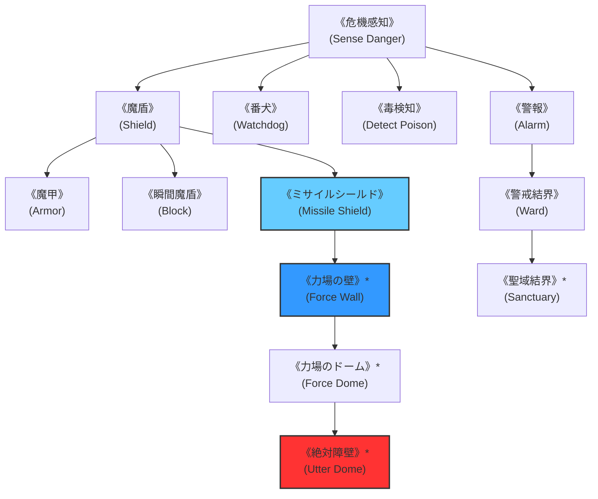

# ガープスマジック呪文体系：防御・警戒系呪文 (Protection & Warning Spells)

**主管部署**: 魔導科学・理論研究部  
**準拠文献**: 『ガープス第4版 魔法大全（GURPS Magic）』第25章 pp.172-176、公式サプリメント各編（magic_page_084.html）  
**準拠憲章**: `AGENTS.md` (多層同心円要塞網・障壁物理力学・重火器突破原則)

---

## 1. 防御・警戒系呪文の基本概要と力学特性

### 1.1 系統特性
- **本質**: 空間の弾性歪みによる力場障壁（シールド・アーマー）、物理弾道偏向、侵入者・危険検知アラーム、および結界都市（セーフゾーン）の防護基盤。
- **障壁突破の物理力学（AGENTS.md 厳格準拠）**:
  - 《矢よけ》《ミサイルシールド》等の障壁は小口径拳銃弾・小銃弾を弾性反発・偏向するが、**12.7mm重機関銃弾、対戦車ミサイル、航空爆撃の圧倒的大運動エネルギー・爆風によって耐衝撃限界を超過し、容易に粉砕・突破される**。
- **現代世界での位置づけ**:
  - 東京多層同心円防衛網（外環防護壁、春日部放水路要塞神殿等）の定常結界維持、および突入PMCの標準防御術式。

---

## 2. 呪文前提系統樹（ツリー構造）

---

## 3. 呪文詳細一覧データ（主要抜粋・全55種）

| 呪文名（日 / 英） | クラス | 持続時間 | エネルギー消費 | 準備時間 | 前提条件 | 出力・効果概要 |
| :--- | :--- | :--- | :--- | :--- | :--- | :--- |
| **《危機感知》** (Sense Danger) | 情報 | 一瞬 | 3点 | 1秒 | なし | 術者に迫る直接の物理的・呪術的危険を直前に感知。 |
| **《警報》** (Alarm) | 通常 | 8時間 | 2点 | 2秒 | 《危機感知》 | 指定エリアやドアに不可視のアラームを設置（侵入時に覚醒音響）。 |
| **《毒検知》** (Detect Poison) | 範囲/情 | 一瞬 | 2点/m | 1秒 | 《危機感知》 | 飲食物、空気、生物の毒素を瞬時に特定。 |
| **《魔盾》** (Shield) | 通常 | 1分 | 1〜4点 (維持半) | 1秒 | 《危機感知》 | 不可視の力場盾を展開（受動防御/回避に+1〜+4のボーナス）。 |
| **《魔甲》** (Armor) | 通常 | 1分 | 2点/DR (維持半) | 1秒 | 《魔盾》 | 全身に防護フィールドを纏う（消費2点につきDR+1、最大DR5程度）。 |
| **《瞬間魔盾》** (Block) | 防御 | 一瞬 | 1点 | 1秒 | 《魔盾》 | 敵の攻撃瞬間に即時障壁を展開し、攻撃を完全ブロック。 |
| **《ミサイルシールド》** (Missile Shield) | 通常 | 1分 | 5点 (維持2) | 2秒 | 《魔盾》 | 飛来する拳銃弾・矢などの小型投射物を自動偏向・弾道逸らし。 |
| **《力場の壁》\*** (Force Wall) | 範囲 | 1分 | 2点/m (維持1) | 1秒 | 素質2、《ミサイルシールド》 | 車両や大型魔獣の突進を受け止める透明な力場壁（DR10〜30・至難）。 |
| **《力場のドーム》\*** (Force Dome) | 範囲 | 1分 | 3点/m (維持2) | 2秒 | 《力場の壁》 | 半球状の密閉障壁を展開（気体・光線・爆風を遮断・至難）。 |
| **《絶対障壁》\*** (Utter Dome) | 範囲 | 1分 | 10点/m | 3秒 | 素質3、《力場のドーム》、10系統各1種 | 物理・魔法を問わずあらゆる干渉を完全遮絶する最高位障壁（至難）。 |
| **《魔法の鍵》** (Magelock) | 通常 | 6時間 | 3点 | 2秒 | 素質1 | ドアや金庫に霊的ロックを施す（呪文破壊か物理破壊のみ開錠可能）。 |
| **《聖域結界》\*** (Sanctuary) | 範囲 | 1日 | 10点/m | 1時間 | 素質2、防御系6種 | 敵性魔獣や悪意ある存在の侵入を拒絶する定常防護結界（至難）。 |

---

## 4. 首都圏要塞網・交戦マニュアルでの適用例

1. **東京多層同心円防衛線の結界維持**:
   - 皇居・コアセーフゾーン（第1同心円）では古代呪具と《聖域結界》《力場のドーム》が重層展開。
2. **重火器による障壁突破（AGENTS.md 戦術原則）**:
   - 《ミサイルシールド》や《魔甲》を展開した魔獣や敵性術士に対し、5.56mm小銃ではなく **12.7mm重機関銃（M2）や対戦車ミサイル（ATM）** を撃ち込み、障壁ごと圧殺・粉砕する標準戦術。
