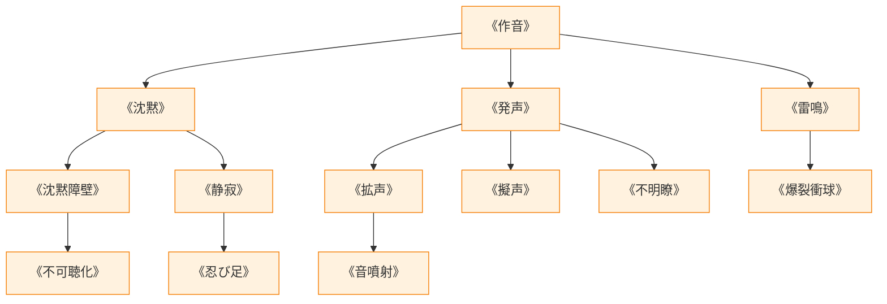

# 音声系呪文 (Sound Spells)

本ドキュメントは、ガープス第4版『魔法大全』第4章（pp.30-33）および関連拡張サプリメントの公式データを基に、音波振動、指向性音響、消音・妨害、および2026年現代における諜報・対魔獣音響戦術を体系化した公式魔術アーカイブです。

---

## 1. 音声系魔術の力学

音声系呪文は、空気や媒質中の粗密波（音波振動）をマナによって生成・変調・相殺する魔術体系です。微小な足音の消音から、鼓膜を破る衝撃波・雷鳴の生成まで広範な音響制御を行います。

### 1.1 前提条件ツリー (Prerequisite Tree)

---

## 2. 音声系主要呪文データ一覧

| 呪文名（日 / 英） | クラス | 基本消費 / 維持 | 詠唱時間 | 前提条件 | 効果概要・力学 |
| :--- | :---: | :---: | :---: | :--- | :--- |
| **《作音》** Sound | 通常 | さまざま | 1秒 | なし | 任意の地点から特定の物音（足音、打撃音等）を発生。 |
| **《沈黙》** Silence | 範囲 | 2 / 1 | 1秒 | 《作音》 | 対象領域内の音波を完全相殺し、完全な無音状態を形成。 |
| **《超音波視覚》** Sound Vision | 通常 | 5 / 2 | 1秒 | 《聴覚鋭敏化》 | コウモリのように音の反響で周囲の三次元形状を把握。 |
| **《雷鳴》** Thunderclap | 通常 | 2 / 不可 | 1秒 | 《作音》 | 爆発的な大音響を放ち、周囲の対象を朦朧・聴覚麻痺させる。 |
| **《発声》** Voices | 通常 | 3 / 2 | 1秒 | 《作音》 | 離れた地点から自然な人声・会話音を発生させる。 |
| **《沈黙障壁》** Wall of Silence | 範囲 | 2 / 1 | 1秒 | 《沈黙》 | 外部への音漏れおよび内部への音の侵入を遮断する音響結界。 |
| **《静寂》** Hush | 通常/抵 | 2 / 1 | 2秒 | 《沈黙》 | 単一の目標から発生するすべての音（発声、呼吸等）を消滅。 |
| **《忍び足》** Mage-Stealth | 通常 | 3 / 2 | 3秒 | 《静寂》 | 術者の足音・衣擦れの音を完全消去（隠密+5）。 |
| **《拡声》** Great Voice | 通常 | 3 / 1 | 2秒 | 《発声》, 《雷鳴》 | 術者の声を数キロ先まで届く大音量へ増幅。 |
| **《音噴射》** Sound Jet | 通常 | 1〜4 / 同 | 1秒 | 《拡声》 | 手先から指向性超音波・衝撃波を噴射（近接打撃+朦朧）。 |
| **《防音》** Resist Sound | 通常 | 2 / 1 | 1秒 | 音声系4種 | 術者の聴覚を過大音響・音波攻撃から完全防護。 |
| **《爆裂衝球》** Concussion | 射撃 | 2〜2×素質 | 1〜3秒 | 《空気変化》, 《雷鳴》 | 強烈な空気衝撃波弾を投射し、広範囲に爆風ダメージ。 |

---

## 3. 2026年現代戦術・対魔獣音響兵器への応用

### 3.1 聴覚鋭敏魔獣に対する指向性音響弾頭・スクリーム作戦
アウトランドに生息する変異コウモリや犬科魔獣など、高周波聴覚に依存する夜行性魔獣に対し、自衛隊音響専門部隊は《音噴射》《雷鳴》および音響グレネード（LRAD）を同期させ、三半規管を破壊して無力化する戦術を採用しています。

### 3.2 メガコーポ情報保全・盗聴遮断結界（CR2）
ヤマト重工やテイコク製薬の役員会議室、および結界都市内の政府重要施設には、レーザーマイクや集音ドローンによる盗聴を完全に阻止するため、《沈黙障壁》が常時エンチャントされた防音ガラス・シールドが標準施工されています。
