# 音声系呪文 (Sound Spells)

本ドキュメントは、ガープス第4版『魔法大全』第4章（pp.30-33）および公式拡張サプリメント（『Magic: Artillery Spells』『Magic: Death Spells』『Magic: The Least of Spells』）に準拠した、**全38種**の音声系公式呪文アーカイブです。音波振動、指向性音響、完全消音、音響物理衝撃波、残響再現（過去聴覚）、ならびに2026年現代における結界都市防衛・対魔獣音響戦術・メガコーポ情報保全の運用データを過不足なく完全網羅しています。

---

## 1. 音声系魔術の力学体系

音声系呪文は、マナの微細周波数共鳴を介して空気中や固体媒質中の音波（粗密波）を生成・変調・位相干渉（消音）・増幅する魔術体系です。
- **生体媒介原則と音圧制御**: マナそのものは物理的音波粒子ではありませんが、媒質分子の振動ベクトルを直接励起します。微小な足音の消滅（完全逆位相相殺）から、鼓膜や内臓を震盪させる140dB超級の爆裂音響衝球までを自在に制御します。
- **電脳音響・盗聴技術との境界**: 音声系魔術は術士の生体聴覚・声帯神経を介して作用します。指向性レーザーマイクやデジタル録音機に対しても、《沈黙障壁》や《不明瞭》による物理的音波変調効果はそのまま有効に機能します。

### 1.1 音声系呪文 前提条件ツリー (Prerequisite Tree)

```mermaid
graph TD
    %% クラススタイル定義（高コントラスト・ダークモード規格）
    classDef spell fill:#0f172a,stroke:#38bdf8,stroke-width:1.5px,color:#ffffff;
    classDef root fill:#0369a1,stroke:#38bdf8,stroke-width:2px,color:#ffffff,font-weight:bold;
    classDef ext fill:#1e293b,stroke:#94a3b8,stroke-width:1px,color:#cbd5e1,stroke-dasharray: 5 5;
    classDef special fill:#4c1d95,stroke:#c084fc,stroke-width:1.5px,color:#ffffff;

    %% 系統内呪文ノード定義
    subgraph Sub_F0107B6 ["28種"]
        Sound["《作音》<br>(Sound)"]:::root
        Sp_2_58BF["《感覚鋭敏化》<br>(（旧名：（感覚）鋭敏化　視覚鋭敏化　聴覚鋭敏化　味嗅覚鋭敏化）)"]:::root
        Silence["《沈黙》<br>(Silence)"]:::spell
        SoundVision["《超音波視覚》<br>(Sound Vision)"]:::spell
        Sp_5_31DC["《雷鳴》<br>(（旧名：雷）)"]:::spell
        Voices["《発声》<br>(Voices)"]:::spell
        Garble["《不明瞭》<br>(Garble)"]:::spell
        Sp_8_E3F9["《擬声》<br>(（旧名：声まね）)"]:::spell
        WallofSilence["《沈黙障壁》<br>(Wall of Silence)"]:::spell
        Hush["《静寂》<br>(Hush)"]:::spell
        MageStealth["《忍び足》<br>(Mage-Stealth)"]:::spell
        GreatVoice["《拡声》<br>(Great Voice)"]:::spell
        Noise["《騒音》<br>(Noise)"]:::spell
        DelayedMessage["《遅発伝言》<br>(Delayed Message)"]:::special
        ResistSound["《防音》<br>(Resist Sound)"]:::spell
        SoundJet["《音噴射》<br>(Sound Jet)"]:::spell
        Concussion["《爆裂衝球》<br>(Concussion)"]:::spell
        Converse["《密談》<br>(Converse)"]:::special
        FarHearing["《遠耳》<br>(Far-Hearing)"]:::root
        Scribe["《筆記》<br>(Scribe)"]:::spell
        MusicalScribe["《採譜》<br>(Musical Scribe)"]:::spell
        Message["《伝言》<br>(Message)"]:::spell
        WizardMouth["《魔法の口》<br>(Wizard Mouth)"]:::spell
        AlterVoice["《声変え》<br>(Alter Voice)"]:::spell
        SilverTongue["《銀の舌》<br>(Silver Tongue)"]:::spell
        Sp_26_B16C["《残響再現》<br>(（旧名：過去聴覚）)"]:::special
        WizardEar["《魔法の耳》<br>(Wizard Ear)"]:::spell
        InvisibleWizardEar["《透明な耳》<br>(Invisible Wizard Ear)"]:::spell
    end

    subgraph Sub_649106C5 ["MAS / MDS 拡張 5種"]
        ImprovedConcussion["《強化爆裂衝球*》<br>(Improved Concussion)"]:::special
        PerilousPulsations["《致傷振動圏*》<br>(Perilous Pulsations)"]:::special
        WitheringWail["《破肉の叫び*》<br>(Withering Wail)"]:::special
        FatalFrequency["《破壊振動*》<br>(Fatal Frequency)"]:::special
        WailoftheBanshee["《死の声がけ*》<br>(Wail of the Banshee)"]:::special
    end

    %% 前提条件依存関係エッジ
    Sound --> Silence
    Ext_1 --> SoundVision
    Sound --> Sp_5_31DC
    Sound --> Voices
    Voices --> Garble
    Voices --> Sp_8_E3F9
    Silence --> WallofSilence
    Silence --> Hush
    Hush --> MageStealth
    Voices --> GreatVoice
    Sp_5_31DC --> GreatVoice
    WallofSilence --> Noise
    Voices --> DelayedMessage
    Ext_2 --> DelayedMessage
    Req_3 --> ResistSound
    GreatVoice --> SoundJet
    Ext_4 --> Concussion
    Sp_5_31DC --> Concussion
    Garble --> Converse
    Silence --> Converse
    Voices --> Scribe
    Ext_5 --> Scribe
    Scribe --> MusicalScribe
    GreatVoice --> Message
    Ext_6 --> Message
    Ext_7 --> WizardMouth
    Ext_8 --> WizardMouth
    GreatVoice --> WizardMouth
    Req_9 --> AlterVoice
    Voices --> SilverTongue
    Ext_10 --> SilverTongue
    Ext_11 --> Sp_26_B16C
    Voices --> Sp_26_B16C
    Ext_7 --> WizardEar
    FarHearing --> WizardEar
    SoundVision --> WizardEar
    WizardEar --> InvisibleWizardEar
    Ext_12 --> InvisibleWizardEar
    Concussion --> ImprovedConcussion
    GreatVoice --> ImprovedConcussion
    Concussion --> PerilousPulsations
    SoundJet --> PerilousPulsations
    GreatVoice --> WitheringWail
    Noise --> WitheringWail
    Concussion --> FatalFrequency
    SoundJet --> FatalFrequency
    Message --> WailoftheBanshee

    %% 外部系統・特殊前提ノード
    Ext_1["【他系統: 《聴覚鋭敏化》】"]:::ext
    Ext_2["【他系統: 《生命感知》】"]:::ext
    Req_3["【前提: 音声系4種】"]:::ext
    Ext_4["【他系統: 《空気変化》】"]:::ext
    Ext_5["【他系統: 《踊る物体》】"]:::ext
    Ext_6["【他系統: 《方向探知》】"]:::ext
    Ext_7["【他系統: 《念動》】"]:::ext
    Ext_8["【他系統: 《遠隔毒見》】"]:::ext
    Req_9["【前提: 肉体操作系4種、音声系4種】"]:::ext
    Ext_10["【他系統: 《感情操作》】"]:::ext
    Ext_11["【他系統: 《来歴》】"]:::ext
    Ext_12["【他系統: 《透明術》】"]:::ext
```

---

## 2. ガープス第4版『魔法大全』基本音声系呪文（28種）

| 呪文名（日 / 英） | クラス | 持続時間 | 基本消費 / 維持 | 詠唱時間 | 前提条件 | 効果概要・力学 |
| :--- | :---: | :---: | :---: | :---: | :--- | :--- |
| **《作音》** Sound | 通常 | さまざま | さまざま | 1秒 | - | 意味のないあらゆる種類の音を、 術者 の思いどおりに作り出します。虫の羽音、遠くのおしゃべり、物がガシャンと落ちる音といったものです。大きな物音は作れません。 呪文 をかけてしまえば、 集中 は必要ありません。 |
| **《感覚鋭敏化》** （旧名：（感覚）鋭敏化　視覚鋭敏化　聴覚鋭敏化　味嗅覚鋭敏化） Keen Sense　Keen Vision　Keen Hearing　Keen Taste and Smell | 通常 | 30分 | 1/修正+1毎/半# | 1秒 | - | やと同様、実際には数種の異なる 呪文 です。最も一般的なバリエーションはですが、「〜 探知 」「 走査感覚 」「 振動感覚 」といった珍しい知覚手段に対応する 呪文 も可能です。は、対応する 知覚判定 について、 |
| **《沈黙》** Silence | 範囲 | 1分 | 2/1 | 1秒 | 《作音》 | 静まり返った空間を作り出します。範囲内にいる者は全員、何も聞こえません。範囲内で何が起ころうと、まったく音を発しません。効果があるのは範囲であって、そこにいる人ではありません。範囲から外に出るとしゃべれるようになります。沈黙の範囲内では、詠唱の必要な 呪文 は働かないことに注意してください！ |
| **《超音波視覚》** Sound Vision | 通常 | 1分 | 5/2 | 1秒 | 《聴覚鋭敏化》ないし「鋭敏聴覚」 | 目標 はコウモリやイルカのように、音でものを見ることができるようになります。まるで「 走査感覚 /ソナー」の 有利な特徴 を持っているかのようにです。の 呪文 をかけられると、をかけられたかのようになります。いっぽうやを使えば、に対して 透明 になれます。充分な光さえあるなら、 目標 は望めば通常の 視覚 でものを見 |
| **《雷鳴》** （旧名：雷） Thunderclap | 通常 | 一瞬 | 2 | 1秒 | 《作音》 | 爆音や雷鳴のような大きな音1つを作り出します。 呪文 の中心として 術者 が選んだ場所が、「 目標 」になります。屋外では、この場所から3メートル以内にいる者は全員、 生命力 判定を行ない、失敗すると耳が聞こえなくなってしまいます。その後1時間ごとに 生命力 判定を行ない、成功すると回復します。閉めきられた空間――一辺が10メートル以内――では、この距離は6メートルになります。 術者 は 生命力 |
| **《発声》** Voices | 通常 | 1分 | 3/2 | 1秒 | 《作音》 | 意味のある音――話し声、音楽など――を、ごくふつうの音量で作り出します。 術者 の側はつねに 集中 していなくてはいけません。 |
| **《不明瞭》** Garble | 通常/抵-意志力 | 1分 | 4/2 | 1秒 | 《発声》 | 目標 （生き物）は意味のある言葉を話せなくなります。口から出る言葉は完全に訳のわからないものになってしまいます。この 呪文 を使えば、敵の 魔術師 を無力化できるでしょう！ |
| **《擬声》** （旧名：声まね） Imitate Voice | 通常/抵-生命力 | 1分 | 3/1 | 1秒 | 《発声》 | 目標 の声を、 術者 が知っている他の生き物1体の声そっくりに変えてしまいます（特殊な抑揚のアクセントも含みます）。記憶のなかから聞き覚えのある声を再現するには、 技能 に-2のペナルティがかかります。もしその声を数回しか、あるいは遠い昔にしか聞いたことがないなら、-3かそれより悪い修正がかかります（「 記憶力 」「 写真記憶 」の 特徴 があれば役に立つでしょう）。まねられた生き物の声を知ってい |
| **《沈黙障壁》** Wall of Silence | 範囲 | 1分 | 2/1 | 1秒 | 《沈黙》 | 効果範囲のまわりに、音が通り抜けられない壁を作り出します。なかにいる者に外の音は聞こえず、外にいる者になかの音は聞こえません。詠唱の必要な 呪文 をかけるのに影響はありません。 |
| **《静寂》** Hush | 通常/抵-意志力 | 10秒# | 2/1 | 2秒 | 《沈黙》 | 目標 （物体か生き物）はそのつもりがあってもなくても、いっさい音をたてられなくなります。 目標 の〈 忍び 〉 技能 は、判定が必要なときはつねに+3のボーナスを得ます。また他の者が 目標 のたてる音に気づくかどうかの 聴覚判定 には-5のペナルティがかかります。この 呪文 を使えば、 戦闘 中の敵の 魔術師 を沈黙させられるでしょう！ |
| **《忍び足》** Mage-Stealth | 通常 | 1分 | 3/2 | 3秒 | 《静寂》 | 目標 は静かに移動したり、音をたてずに呼吸したりできるようになります。必要なら話をすることもできます。その他の効果はと同じです。 |
| **《拡声》** Great Voice | 通常 | 1分 | 3/1 | 2秒 | 《発声》、《雷鳴》 | 目標 の声は、どんなに距離があろうと目に見えている相手にはっきり明白に聞こえるようになります。しゃべりだす前に特定するなら、選んだ何人かにだけ聞かせることもできます（もちろん、しゃべる側が望もうと望むまいと、ふつうに声の届く範囲にいる相手には聞こえます）。たとえば、岩のかげに隠れようとも 目標 の声をさえぎることはできないので注意してください。この 呪文 は広く船長や軍隊の指揮官、大衆演説者に使わ |
| **《騒音》** Noise | 範囲 | 5秒 | 4/2 | 1秒 | 《沈黙障壁》 | 効果範囲に、意味のないきわめて大きな物音をひっきりなしに作り出します。範囲内にいる者はまったく会話できず、他の音を聞き取ることもできません。 知力 を基本とする 技能 を使おうとしても、気が散るか（たとえば 呪文 のとき）、-3のペナルティを受けてしまいます（あるいはその両方！ GM が決めてください）。効果範囲は、で囲まれているものとします。に抵抗したり、抵抗されたり |
| **《遅発伝言》** Delayed Message | 範囲 | 不定# | 3# | 4秒 | 素質1、《発声》、《生命感知》 | 口頭の伝言を作り出しますが、 呪文 をかけるさいに特定した人物が範囲内に到着するまでは発するのを延期します。受取人は他に物音があろうと伝言をはっきり聞き取れますが、他の者にはまったく聞こえません。の 呪文 をこの範囲にかけると、遅発伝言があることはわかりますが、 クリティカル 成功でないかぎり、それ以上のことはわかりません。 クリティカル で成功すると、「送り主」「受け取り人」「伝 |
| **《防音》** Resist Sound | 通常 | 1分 | 2/1 | 1秒 | 音声系4種 | 目標 （人物、生き物、物体）と 目標 が持ち運んでいるものはすべて、音の影響を受けつけなくなります。で耳が聞こえなくなることはなく、音波武器にも傷つきません。で 朦朧 とすることもありません。ただし、には気が散るかもしれません。 文明レベル が高い世界ではひじょうに一般的な 呪文 です。 |
| **《音噴射》** Sound Jet | 通常 | 1秒 | 1〜4/同 | 1秒 | 《拡声》 | 指先から、つんざくような音を細いビームにして発射します。 術者 は毎 ターン 、〈 特殊攻撃 〉か 敏捷力 -4で 命中判定 を行ないます。この 攻撃 は「 よけ 」「 止め 」ができますが、「 受け 」はできません。じっさいにダメージはありませんが、噴射が命中した者は、「 生命力 - 呪文 に費やされた エネルギー 」で判定を行ない、失敗すると 朦朧 としてしまいます（『 ベーシックセット 』3 |
| **《爆裂衝球》** Concussion | 射撃 | 一瞬 | 2〜2×素質# | 1〜3秒 | 《空気変化》、《雷鳴》 | 術者 の手元に高圧で圧縮した空気の球を作り出します。この球は、 目標 に命中すると 爆発 します。非常に大きな爆発音がするため、10メートル以内にいる者はすべて 生命力 -3の判定に成功しなければなりません。失敗すると 朦朧 状態になってしまいます。 朦朧 状態になった場合、毎 ターン 生命力 -3の判定を行ない、成功すると 朦朧 状態を脱します。「 聴覚保護 」の 特徴 があれば、 生命力 判定 |
| **《密談》** Converse | 通常/抵-呪文 | 不定# | 2 | 1秒 | 素質1、《不明瞭》、《沈黙》 | 術者 と 目標 は、立ち聞きされることなくひそかに会話できるようになります。まわりがうるさくても（騒々しいパーティの場でも）かまいません。 術者 も 目標 も、あたりの騒音を無視して、相手の言葉をはっきり聞き取ることができます。ふつうに声の届く範囲にいる他の人々には、意味のわからないうなり声のようなものが聞こえるだけです。 この 呪文 はのような音を遮断する 呪文 に抵抗し |
| **《遠耳》** Far-Hearing | 情報 | 1分 | 4/2 | 3秒 | 素質1、音声系4種、「聴覚障害」「難聴」なし | 術者 は視界内で行われている会話を何でも聞き取れます。どんなに離れていてもよく、厚さの合計が1.8メートル以内の固体があいだにあってもかまいません。 術者 はあらゆる 聴覚判定 に自動的に成功します。 |
| **《筆記》** Scribe | 通常 | 1分 | 3/1 | 1秒 | 《発声》、《踊る物体》、「なまりがある」以上で読み書きできる言語1種 | ペンに命を吹きこみ、 呪文 が持続するかぎり、 術者 が口述する内容を何でも書きとめさせます。 呪文 に失敗しても、 失敗度 が1〜2なら、ペンに命は宿ります。ただし、書きとめた内容は完全に正確というわけにはいきません！ですから、 術者 はつねに仕事を再点検するべきでしょう。 文明レベル が高くなると、タイプライターや コンピュータ のキーボード、その他の筆記用具に対しても使えます。 |
| **《採譜》** Musical Scribe | 通常 | 1分 | 3/1# | 1秒 | 《筆記》 | ペンに命を吹きこみ、 術者 がハミングしたり、歌ったり、楽器で演奏したりする旋律を楽譜の形で記録させます。 術者 自身でなく、他人（あるいはラジオなど）が作り出した音を書きとめられるようにもできます。ペンが記録できるのは音楽だけです。同時に歌詞も記録したいなら、のかかった2本めのペンを用意すれば可能でしょう。 |
| **《伝言》** Message | 通常/抵-呪文 | さまざま | 1/15秒毎 | さまざま | 《拡声》、《方向探知》 | 術者 から 目標 に口頭の伝言を届けます。 長距離の修正値 を使ってください。 術者 が 目標 のことを知らないなら、-2の修正がかかります。 目標 がどこにいるかわからないなら、-5の修正がかかります（に成功すればこの修正を打ち消します）。これらのペナルティは累積します。に成功すると、+5のボーナスがあります。 目標 は周囲がどんなにうるさくても、伝言をはっきり明確に |
| **《魔法の口》** Wizard Mouth | 通常 | 1分 | 4/2 | 2秒 | 《念動》、《遠隔毒見》、《拡声》 | 術者 によく似た10センチほどの口と唇を作り出します。 術者 はその口を通じて喋ったり味わうことができます。口は 移動力 10で 術者 の ターン に 移動 しますが、ものにぶつかりそうであれば 移動 しないかもしれませんと組み合わせない限り）。 移動 させるには 集中 が必要ですが、喋ったり味わったりするだけなら 集中 しなくても構いません。音声や味覚に影響を与え |
| **《声変え》** Alter Voice | 通常/抵-生命力 | 1時間 | 2/2 | 1分 | 肉体操作系4種、音声系4種 | 目標 の声を 術者 の望んだように変更します。実在する誰かの声を真似ようと思ったら、その「モデル」になる声が必要です。なじみのある声を記憶で再現する場合、-2の修正を受けます。数回しか聞いたことのない声だったり、ずいぶん昔に聞いた声を再現する場合は-3以上の不利な修正をうけます。「 記憶力 」（『 ベーシックセット 1巻』44ページ）の 特徴 は有効です。 |
| **《銀の舌》** Silver Tongue | 通常 | 1分 | 3/2 | 1秒 | 《発声》、《感情操作》 | 目標 に「 美声 」の 有利な特徴 を与えます。すでにこの 特徴 を持っている生き物には効果がありません。 |
| **《残響再現》** （旧名：過去聴覚） Echoes of the Past | 通常 | 1分 | 2/2# | 10秒 | 素質2、《来歴》、《発声》 | 壁、床などの物体に対して唱えます。この 呪文 は 目標 が過去に「聞いた」音声を「再生」します。 術者 は唱えるさいに再生を開始する時間を指定します（「今から1年前にこの部屋で何が話されたか教えなさい.......」）。 時間修正表 （135ページ）を用います。1つの 目標 に対して何度も同じ時間を指定して唱えると、1回ごとに-1の修正がかかります。 ファンブル すると、 目標 がもつその時間の「 |
| **《魔法の耳》** Wizard Ear | 通常 | 1分 | 4/3 | 2秒 | 《念動》、《遠耳》、《超音波視覚》 | 術者 の耳とそっくりなものを作り、それを通してものを聞けるようになります。耳は何かにぶつかることなく動きまわりますが（を持っているかのようにです）、ふつうの大きさや形の部屋以外のものを「見る」ことはできません。この 呪文 を、すでに存在する（通常のものでも透明のものでも）にかけることもできます。目の形は変わりませんが、会話やその他の音を聞き取れるようになります。 |
| **《透明な耳》** Invisible Wizard Ear | 通常 | 1分 | 5/3 | 4秒 | 《魔法の耳》、《透明術》 | の 呪文 を使わないかぎり見えないを作り出します。この耳の存在を推測できれば 攻撃 することができますが、目に見えないことと小さなことによるペナルティが累積してかかるため、命中させるのはほとんど不可能でしょう。 |

---

## 3. 魔導兵器・音響戦術拡張呪文（MAS / MDS 拡張 5種）

『GURPS Magic: Artillery Spells（MAS）』および『GURPS Magic: Death Spells（MDS）』に収録された、音波振動を組織破壊・共振破砕・即死音響エネルギーへと昇華させた軍事拡張呪文です。

| 呪文名（日 / 英） | クラス | 持続時間 | 基本消費 / 維持 | 詠唱時間 | 前提条件 | 効果概要・力学 |
| :--- | :---: | :---: | :---: | :---: | :--- | :--- |
| **《強化爆裂衝球*》** Improved Concussion* | 射撃 | 一瞬 | 3〜3×素質 | 1〜3秒 | 素質4、《爆裂衝球》と《拡声》を含む音声系呪文7種 | と同様ですが、 爆発 半径が広くなっています。中心から1ｍ以上離れた対象へのダメージは、距離の3倍ではなく、距離（1メートル）で割ります。 朦朧 を回避するために 生命力 -3判定が必要となる範囲は10ｍのままですが、11〜20ｍであっても、全員が 朦朧 を回避するための 生命力 判定を行う必要があります（ 朦朧 に陥った場合は、毎 ターン 回復するための 生命力 判定を行う必要が |
| **《致傷振動圏*》** Perilous Pulsations* | 範囲/抵-生命力 | 5秒 | 5・同 | 3秒 | 素質4、《爆裂衝球》と《音噴射》を含む音声系呪文7種 | 効果範囲内の全ての物質的対象（生物・非生物を問わず）に内部振動を発生させます。毎 ターン 、範囲内の全ての対象は 呪文 に 抵抗判定 し、抵抗失敗した犠牲者は1d HP の 負傷 を受けます（場合によっては破壊されます）。これにより装甲や丈夫な皮膚などが損傷します。 DR は効果を持ちません。 多くの とは異なり、この 呪文 は大気を必要とせず、通常は音もなりません――振動は影響を受け |
| **《破肉の叫び*》** Withering Wail* | 通常 | 一瞬 | 2〜10/半径1ｍ毎 | 1秒/威力1d毎 | 素質4、《拡声》と《騒音》を含む音声系呪文10種 | 術者 は、生きた肉体を破壊するほどの周波数で、恐ろしい叫び声を発することができます。 |
| **《破壊振動*》** Fatal Frequency * | 通常/抵-生命力 | 一瞬 | 6 | 3秒 | 素質3、《爆裂衝球》、《音噴射》 | 対象（物質であれば何でも可）を内部から揺さぶろうとします。対象が抵抗に失敗すると、 呪文 は通常はダメージに抵抗する構造に内部振動を引き起こします。結果を決定するには、 呪文 の 仮威力 （1d から 8d）を振り、その合計値を犠牲者の HP の2倍と比較します。 その合計値が2× H |
| **《死の声がけ*》** Wail of the Banshee * | 通常/抵-生命力 | 一瞬 | 11 | 1秒 | 素質3、《伝言》を含む任意の音声系呪文を10種 | 術者 は、誰にでも聞こえるが特定の犠牲者を狙った致命的な叫び声を発します。 術者 は対象者の名前を知っているか（一般的な名前で構いません）、対象者を見て指さすことができる必要があります。 この 呪文 が効くためには、 術者 から対象者への経路が流体媒質（空気や水など）を介して存在する必要があります。つまり、 魔法使い が叫んでいる場合、その叫び声が対象の場所で聞こえる必要があります。ただし、犠牲者 |

---

## 4. 日常・民間簡単呪文（The Least of Spells 拡張 5種）

『GURPS Magic: The Least of Spells（Mtlos）』に収録された、民間術士（ヘッジ・メイジ）や現場捜査官が日常的に行使する低燃費・実用音声呪文です。前提条件不要または極小のエネルギーで即時発動可能です。

| 呪文名（日 / 英） | クラス | 持続時間 | 基本消費 / 維持 | 詠唱時間 | 前提条件 | 効果概要・力学 |
| :--- | :---: | :---: | :---: | :---: | :--- | :--- |
| **《ペット呼び》（並）** （Call (A)） | 通常 | 1分 | 1・同 | 1秒 | -（簡単呪文なので） | 術者 は、訓練された既知の 動物 （ペットや乗馬など）を遠くから呼び出します。獣はこれに気づくために 聴覚 判定 に+3を獲得し、通常の8倍の距離から呼びかけられることができます。生物が応答するかどうかは、訓練と呼び出し者に対する態度によって異なります。は、ペットホイッスル（犬笛など）の非常に大きなものに相当する効果を提供します。 |
| **《音害微減》（並）** （Selective Hearing (A)） | 通常 | 1分 | 1・同 | 1秒 | -（簡単呪文なので） | 対象は、騒音による 聴覚 ペナルティの-1修正分を無視し、耳をつんざくような騒音（など）に抵抗するための 生命力 判定と、音による 集中切れ に抵抗するための 意志力判定 に+1ボーナスを得ます。 |
| **《きしみ音》（並）** （Squeak (A)） | 通常 | 1分 | 1 | 1秒 | -（簡単呪文なので） | きしむ床板、油が必要な蝶番、ネズミなどに似た、短く低強度の高音を発します。 聴覚判定距離表 の「葉の揺れる音」の行を使用します。主に人をいらだたせるのに便利ですが、異常に静かな環境では誰かの気をそらす可能性があります ( GM の判断)。 |
| **《投げ声》（並）** （Throw Voice (A)） | 通常 | 1分 | 2・1 | 2秒 | -（簡単呪文なので） | 対象は 腹話術 でできると見なされることを実行できます 。つまり、離れた場所から声を出すことです（ただし、 技能 や道具活用能力は付与されません）。これには〈 腹話術 〉判定が必要で、距離1メートルにつき-1修正です。この 技能 を持たない対象は 知力 -6を使用します (通常、〈 腹話術 〉には 技能なし値 はありません)。それでも1メートルにつき-1修正です。この 呪文 は吟遊詩人やその他のエ |
| **《水中会話術》（並）** （Mer-Speech (A)） | 通常 | 1分 | 2・1 | 2秒 | -（簡単呪文なので） | 対象は一時的に 有利な特徴 「 水中会話 」を得ます。 |

---

## 5. 2026年現代戦術・対魔獣音響兵器・情報保全における運用

### 5.1 聴覚鋭敏魔獣に対する指向性音響弾頭・スクリーム作戦
アウトランドに生息する変異コウモリ、犬科魔獣、大型幻獣など、高周波聴覚に依存する夜行性生物に対し、自衛隊音響専門部隊や民間重火器PMCは《音噴射》《雷鳴》《爆裂衝球》および指向性長距離音響発生装置（LRAD）を同期させ、三半規管および前庭器官を過負荷粉砕して無力化する戦術を採用しています。

### 5.2 メガコーポ情報保全・盗聴遮断結界（CR2 / Class-2情報管理規約）
ヤマト重工、テイコク製薬、サエデル・シュティフトゥング等のメガコーポ役員会議室や先端研究所には、レーザー干渉計マイクや電脳ドローンによる盗聴を完全に阻止するため、《沈黙障壁》《密談》が常時施工された防音二重ガラスが標準装備されています。また、重要容疑者の取り調べや犯罪現場では《残響再現》（過去聴覚）による音響捜査が科捜研・警視庁公安部で行われています。

### 5.3 軍事音響兵器（MAS/MDS）の国際規制（CR4）
《破壊振動*》《死の声がけ*》《破肉の叫び*》などの軍事拡張呪文は、非装甲の人体・生体組織に対して防弾ベスト（DR）を完全に貫通・無視して内臓破裂を引き起こすため、国際魔導協定（IMA）により**規制等級CR4（大量破壊・非人道術式）**として厳格に禁止・戦時国際法違反指定されています。