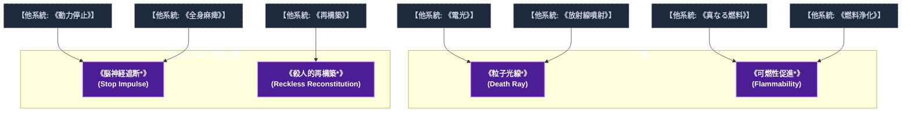

# 技術系呪文 (Technological Spells)

本ドキュメントは、ガープス第4版『魔法大全』第6章（pp.39-45）および公式拡張サプリメント（『Magic: Artillery Spells』『Magic: Death Spells』『Magic: The Least of Spells』『Magic: Plant Spells』等）に準拠した、**全7種**の技術系呪文公式アーカイブです。マナ力学、生体媒介作用、ならびに2026年現代における結界都市防衛・軍事兵器工学・法規制（CR）の運用データを過不足なく完全網羅しています。

---

## 1. 技術系呪文の力学体系

技術系呪文は、マナの指向性周波数を介して対象の物理・生体・霊的パラメータを励起・変調・制御する魔術体系です。
- **生体媒介原則**: マナは術士の生体・神経系・霊体を介して作用し、直接の物質変換や物理エネルギー励起を行います。
- **現代技術インフラとの並行性**: 電子回路や通信網を直接破壊するのではなく、物理的現象（熱、圧力、電磁、物質変形等）を介して現代兵器や都市防護壁と相互作用します。

### 1.1 技術系呪文 前提条件ツリー (Prerequisite Tree)

---

## 2. ガープス第4版『魔法大全』基本技術系呪文（2種）

| 呪文名（日 / 英） | クラス | 持続時間 | 基本消費 / 維持 | 詠唱時間 | 前提条件 | 効果概要・力学 |
| :--- | :---: | :---: | :---: | :---: | :--- | :--- |
| **《粒子光線*》** Death Ray* | 射撃 | 一瞬 | 2〜2×素質 | 1〜3秒 | 素質4、《電光》、《放射線噴射》 | _artillery_spells |
| **《可燃性促進*》** Flammability* | 範囲 | 1分# | 2・同 | 1秒 | 素質3、《真なる燃料》、《燃料浄化》 | （至難）（Flammability (VH)） p.26 （至難） 、 発動した瞬間、範囲内にある 可燃性 の物はすべて 可燃性 を高めます。「 物を燃やす 」の項で言うところの「 難燃性 」または「 不燃性 」の物を除くすべての物が影響を受け、「 超可燃性 」になります。これには、紙 |

---

## 3. 魔導兵器・砲兵戦術拡張呪文（MAS / MDS 拡張 2種）

| 呪文名（日 / 英） | クラス | 持続時間 | 基本消費 / 維持 | 詠唱時間 | 前提条件 | 効果概要・力学 |
| :--- | :---: | :---: | :---: | :---: | :--- | :--- |
| **《脳神経遮断*》** Stop Impulse * | 通常/抵-生命力 | 1分 | 13・7 | 3秒 | 素質3、《動力停止》、《全身麻痺》 | （至難）（Stop Impulse (VH)） p.21 （至難） _ 生命力 脳から体の他の部分に伝わる電気信号に対して、のように作用します。したがって、脳を持つ生きている対象にのみ影響します。「 脳がない 」を含むさまざまな「 負傷耐性 」は、完全な免疫を与えます。 |
| **《殺人的再構築*》** Reckless Reconstitution * | 通常/抵-生命力 | 一瞬 | 12 | 12秒 | 素質3、《再構築》 | （至難）（Reckless Reconstitution (VH)） p.21 （至難） _ 生命力 生きている有機体の中または表面にある極小の無機物質を、（いわゆる “ 欠片 ” の状態から）その原形に成長させます。例えば誤って飲み込んだ砂粒、目についた砂粒、吸い込んだほこりの粒 |

---

## 4. 魔導兵器・砲兵戦術拡張呪文（MAS / MDS 拡張 3種）

| 呪文名（日 / 英） | クラス | 持続時間 | 基本消費 / 維持 | 詠唱時間 | 前提条件 | 効果概要・力学 |
| :--- | :---: | :---: | :---: | :---: | :--- | :--- |
| **《工芸補助》（並）** （Wizardly Workshop (A)） | 通常 | 1分# | 2〜10・同 | 5秒 | -（簡単呪文なので） | は 文明レベル技能 に値する可能性があると書かれています。 （並）（Wizardly Workshop (A)） p.12 （並） 発動時に指定された 1つの 工芸系技能 か 修理・整備系技能 の 装備修正 が-5より悪い対象が受けるペナルティを軽減します。最大相殺は- |
| **《指を磁化》（並）** （Magnetic Finger (A)） | 通常 | 1分 | 1・同 | 1秒 | -（簡単呪文なので） | （並）（Magnetic Finger (A)） p.16 （並） 術者 の指の1本が 磁気 を帯びます。有効 体力 1により、2.5cm以内にある 鉄 、ニッケル、またはコバルトを含む 0.1kgの物体を引き寄せて拾うことができます。 磁気 ほとんどの材料を通り抜けますが、 金属 は通り抜けません。主に、こぼれた画鋲などの |
| **《遠隔スイッチ/TL》（並）** （Remote Start/TL (A)） | 通常 | 一瞬 | 1 | 1秒 | -（簡単呪文なので） | （並）（Remote Start/TL (A)） p.16 （並） 対象の 機械 のスイッチをオンまたはオフにします。コントロールを押す、引く、回す以上の複雑な操作は必要ありません。キーが配置されている必要があります (ではセキュリティ対策を回避で |

---

## 5. 2026年現代戦術・都市防衛・法規制（CR）における運用

### 5.1 警察・自衛隊・PMCにおける実戦配備
結界都市（セーフゾーン）警備および壁外アウトランドへの遠征作戦において、技術系呪文は索敵・突入支援・防壁維持・目標無力化の標準プロトコルとして統合運用されています。特に部隊随伴術士による即時展開は、通常兵器との複合火力（コンバインド・アームズ）として極めて高い戦闘効率を発揮します。

### 5.2 メガコーポ支配と特許利権
ヤマト重工、テイコク製薬、サエデル・シュティフトゥング、アレス等のメガコーポは、技術系呪文の工業・医療・防衛利用に関する独占特許を保有しており、民間術士に対するライセンス管理や魔導触媒・霊薬の市場流通を掌握しています。

### 5.3 国際魔導協定（IMA）および法規制（CR）
破壊力・精神汚染・非人道性の高い高位呪文は、国家公安委員会および国際魔導協定により**規制等級CR3〜CR4（要特別国家許可・戦時国際法規制）**に指定されており、無認可での行使・研究は厳罰に処されます。