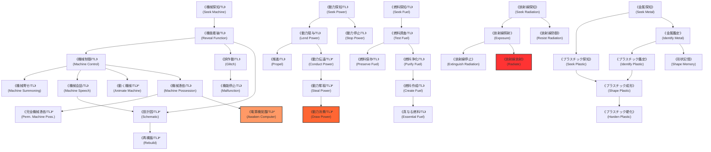

# ガープスマジック呪文体系：技術系呪文 (Technological Spells)

**主管部署**: 魔導科学・理論研究部  
**準拠文献**: 『ガープス第4版 魔法大全（GURPS Magic）』第6章 pp.39-46、公式サプリメント各編  
**準拠憲章**: `AGENTS.md` (生体媒介原則・テクノマジック黎明期・TL8〜9基準)

---

## 1. 技術系呪文の基本概要と世界観的位置づけ

### 1.1 系統特性と文明レベル（TL）
- **本質**: 機械装置、電力・動力源、放射線、および人工高分子（プラスチック・合金）と生体マナを同調・干渉させる近代術式群。
- **文明レベル技能**: 技術系呪文の多くは **TL（Tech Level）技能** であり、術者は自身の習得したTL水準（現代はTL8）を基準として行使する。対象機械のTLが異なる場合は判定にペナルティを受ける。
- **生体媒介原則（AGENTS.md 厳格準拠）**:
  - 電子回路そのものにマナが流れているのではなく、**術者が生体電位・脳神経系を介してコンピュータや端末に同調・干渉する「生体媒介技術」**である。
  - メガコーポ（三ツ菱マナテック、ヤマト重工等）が極秘研究を進める「電脳魔術」の理論的土台となっている。

---

## 2. 技術系呪文 前提系統樹（ツリー構造）

---

## 3. 呪文詳細データ一覧

### 3.1 機械系呪文（Machine Spells - 13種）
知性や自由意志を持たない機械装置（生命力10基準）を操作・同調・クラッキングする呪文群。

| 呪文名（日 / 英） | クラス | 持続時間 | エネルギー消費 | 準備時間 | 前提条件 | 出力・効果概要 |
| :--- | :--- | :--- | :--- | :--- | :--- | :--- |
| **《機械探知/TL》** (Seek Machine) | 情報 | 一瞬 | 3点 | 1秒 | なし | 半径5m以内の特定機械を探知。 |
| **《機能看破/TL》** (Reveal Function) | 情報 | 一瞬 | 2点 | 5秒 | 《機械探知》 | 未知の機械の用途、操作方法、故障箇所を解明。 |
| **《機械制御/TL》** (Machine Control) | 通常 | 1分 | 1点/重量100kg (維持半) | 1秒 | 《機能看破》 | 手を触れずに機械を手動操作通りに遠隔操縦する。 |
| **《機械寄せ/TL》** (Machine Summoning) | 通常 | 1分 | 1点/重量100kg | 1秒 | 《機械制御》 | 自走可能な機械（車両等）を自身の元へ呼び寄せる。 |
| **《機械会話/TL》** (Machine Speech) | 通常 | 1分 | 4点 (維持2) | 1秒 | 《機械制御》 | 機械に蓄積された過去の稼働ログや状態を対話形式で聴取。 |
| **《誤作動/TL》** (Glitch) | 通常/抵 | 一瞬 | 1点/重量100kg | 1秒 | 《機能看破》 | 対象機械に一時的な噛み込み、ジャミング、誤作動を誘発。 |
| **《機能停止/TL》** (Malfunction) | 通常/抵 | 一瞬 | 2点/重量100kg | 1秒 | 《誤作動》 | 対象機械の重要部品を破壊・完全停止（要修理）。 |
| **《設計図/TL》\*** (Schematic) | 情報 | 一瞬 | 5点 | 10秒 | 知力13以上、《機械会話》《機能看破》 | 機械の内部精密構造を完全に把握し、設計図を脳内に描く（至難）。 |
| **《再構築/TL》\*** (Rebuild) | 通常 | 永久 | 10点/重量10kg | 1時間 | 素質2、《設計図》、火霊4種、地霊4種 | 残骸や破片から破損機械を完全に復元・修復（至難）。 |
| **《動く機械/TL》\*** (Animate Machine) | 通常 | 1分 | 2点/重量10kg (維持同) | 2秒 | 素質1、《機械制御》、物体操作2種 | 動力のない静止機械（工具等）を自律行動させる（至難）。 |
| **《機械憑依/TL》** (Machine Possession) | 通常/抵 | 1分 | 4点 (維持2) | 2秒 | 素質2、《機械制御》、精神操作2種 | 術者の意識を機械へ転移させ、自らの身体のように操る。 |
| **《完全機械憑依/TL》\*** (Permanent Machine Possession) | 通常/抵 | 永久 | 10点 | 1分 | 《機械憑依》 | 自身の肉体を捨て、意識を永久に機械構造へ定着（至難）。 |
| **《電算機覚醒/TL》\*** (Awaken Computer) | 通常 | 1分 | 6点 (維持3) | 3秒 | 素質3、《機械憑依》、知力13以上 | コンピュータに疑似的人格と高度な自律知性を一時付与（至難・電脳魔術の根幹）。 |

---

### 3.2 動力系呪文（Energy Spells - 16種）
電気、燃料、運動エネルギーなどの物理動力を直接マナと交換・変換する呪文群。

| 呪文名（日 / 英） | クラス | 持続時間 | エネルギー消費 | 準備時間 | 前提条件 | 出力・効果概要 |
| :--- | :--- | :--- | :--- | :--- | :--- | :--- |
| **《動力探知/TL》** (Seek Power) | 情報 | 一瞬 | 3点 | 1秒 | なし | 稼働中の電源、バッテリー、送電線を感知。 |
| **《燃料探知/TL》** (Seek Fuel) | 情報 | 一瞬 | 3点 | 1秒 | なし | ガソリン、重油、可燃性ガス等の燃料を探知。 |
| **《燃料調査/TL》** (Test Fuel) | 情報 | 一瞬 | 1点 | 2秒 | 《燃料探知》 | 燃料の純度、劣化度、添加物の有無を判別。 |
| **《燃料保存/TL》** (Preserve Fuel) | 通常 | 1日 | 1点/100L | 5秒 | 《燃料調査》 | 燃料の揮発や経年劣化を完全に防止。 |
| **《燃料浄化/TL》** (Purify Fuel) | 通常 | 永久 | 1点/10L | 5秒 | 《燃料調査》、地霊系《土壌浄化》 | 水や不純物が混入した粗悪燃料を完全精製。 |
| **《燃料作成/TL》** (Create Fuel) | 通常 | 永久 | 3点/L | 3秒 | 《燃料浄化》、火霊系《炎作成》 | 無から高品質な液体・気体燃料を生成。 |
| **《真なる燃料/TL》** (Essential Fuel) | 通常 | 永久 | 5点/L | 5秒 | 《燃料作成》、火霊系《真なる火》 | 通常の3倍のエネルギー密度を持つ高効率燃料を精製。 |
| **《動力停止/TL》** (Stop Power) | 通常 | 1分 | 2点/kW (維持1) | 1秒 | 《動力探知》 | 送電回路を遮断し、電気機器への電力供給を一時停止。 |
| **《動力賦与/TL》** (Lend Power) | 通常 | 1分 | 1点/kW (維持1) | 1秒 | 《動力探知》 | 術者のFPを直接電力に変換し、機器を緊急稼働。 |
| **《推進/TL》** (Propel) | 通常 | 1秒 | 1点/100kg (同維持) | 1秒 | 《動力賦与》 | 車両や航空機のエンジン出力を一時的に急激ブースト。 |
| **《動力伝達/TL》\*** (Conduct Power) | 通常 | 1分 | 2点 (維持1) | 2秒 | 素質1、《動力賦与》 | 空間や自らの身体を通して電力をロスなく伝送（至難）。 |
| **《動力奪取/TL》\*** (Steal Power) | 通常 | 一瞬 | なし（逆吸収） | 2秒 | 素質2、《動力伝達》 | 外部電源から電力を吸収し、自身のFPを回復（至難）。 |
| **《動力消費/TL》\*** (Draw Power) | 通常 | 特殊 | なし（電力消費） | 特殊 | 素質3、《動力奪取》 | 発電機等の大電力（360kW=1FP）を直接呪文エネルギーに変換（至難）。 |
| **《磁力視覚》** (Magnetic Vision) | 通常 | 1分 | 2点 (維持1) | 1秒 | 《動力探知》 | 磁界や送電線から漏れる磁力線を可視化。 |
| **《電波聴覚》** (Radio Hearing) | 通常 | 1分 | 2点 (維持1) | 1秒 | 《動力探知》、音声系2種 | 無線通信波やWi-Fi電波を脳内で直接音声復調して傍受。 |
| **《電磁波視覚》\*** (Spectrum Vision) | 通常 | 1分 | 4点 (維持2) | 1秒 | 素質1、《磁力視覚》《電波聴覚》 | 赤外線・紫外線・X線・電波を含む全電磁波スペクトルを視覚化（至難）。 |

---

### 3.3 放射線系呪文（Radiation Spells - 7種）
電離放射線（アルファ・ベータ・ガンマ線、中性子線）を操作・検知・遮蔽する呪文群。

| 呪文名（日 / 英） | クラス | 持続時間 | エネルギー消費 | 準備時間 | 前提条件 | 出力・効果概要 |
| :--- | :--- | :--- | :--- | :--- | :--- | :--- |
| **《放射線探知》** (Seek Radiation) | 情報 | 一瞬 | 3点 | 1秒 | なし | 周囲の放射線源や被曝汚染エリアを探知。 |
| **《放射線調査》** (See Radiation) | 通常 | 1分 | 2点 (維持1) | 1秒 | 《放射線探知》 | 空間内の放射線量を肉眼で輝きとして視認。 |
| **《放射線照射》** (Exposure) | 通常/抵 | 一瞬 | 1点/1rad | 1秒 | 《放射線調査》 | 対象に指定線量の放射線を瞬時に照射（被曝損傷）。 |
| **《放射線防御》** (Resist Radiation) | 通常 | 1時間 | 2点〜 (維持半) | 2秒 | 《放射線探知》 | 対象の身体に放射線防護DRを付与（内部被曝完全遮蔽）。 |
| **《放射線停止》** (Extinguish Radiation) | 通常 | 永久 | 1点/1000rad | 5秒 | 《放射線防御》 | 汚染物質や土壌から放射能を瞬時に完全除去・無害化。 |
| **《放射線放射》\*** (Radiate) | 通常 | 1分 | 4点/rad (維持同) | 2秒 | 素質2、《放射線照射》 | 術者自身の身体から全方位へ致死性ガンマ線を放射（至難）。 |
| **《放射線障壁》\*** (Radiation Jet) | 通常 | 1秒 | 1〜3点 | 1秒 | 素質2、《放射線放射》 | 指先から高エネルギー中性子・ガンマ線ビームを射出（至難）。 |

---

### 3.4 金属・プラスチック系呪文（Metal & Plastic - 9種）
人工高分子、合成樹脂、工業用合金を軟化・成形・硬化させる呪文群。

| 呪文名（日 / 英） | クラス | 持続時間 | エネルギー消費 | 準備時間 | 前提条件 | 出力・効果概要 |
| :--- | :--- | :--- | :--- | :--- | :--- | :--- |
| **《金属探知》** (Seek Metal) | 情報 | 一瞬 | 2点 | 1秒 | 地霊系《地中探知》 | 鉄、アルミ、チタン等の金属を探知。 |
| **《金属鑑定》** (Identify Metal) | 情報 | 一瞬 | 2点 | 2秒 | 《金属探知》 | 合金組成、純度、金属疲労度を特定。 |
| **《形状記憶》** (Shape Memory) | 通常 | 永久 | 3点/kg | 5秒 | 《金属鑑定》 | 金属に特定の形状記憶特性を付与。 |
| **《金属軟化》** (Soft Metal) | 通常 | 1分 | 2点/kg (維持1) | 2秒 | 《金属鑑定》、地霊系《土変化》 | 鋼鉄などの金属を粘土のように素手で加工可能にする。 |
| **《プラスチック探知》** (Seek Plastic) | 情報 | 一瞬 | 3点 | 1秒 | 《金属探知》 | 合成樹脂、カーボン、ポリマーを探知。 |
| **《プラスチック鑑定》** (Identify Plastic) | 情報 | 一瞬 | 2点 | 2秒 | 《プラスチック探知》 | 樹脂の種類、耐熱性、分子劣化度を特定。 |
| **《プラスチック成形》** (Shape Plastic) | 通常 | 1分 | 1点/kg (維持半) | 1秒 | 《プラスチック鑑定》 | プラスチック製品を自由に変形・加工。 |
| **《プラスチック硬化》** (Harden Plastic) | 通常 | 1時間 | 2点/kg (維持1) | 3秒 | 《プラスチック成形》 | 汎用樹脂の硬度をチタン合金並（DR+6）に硬化。 |
| **《プラスチック脆化》** (Brittle Plastic) | 通常/抵 | 一瞬 | 2点/kg | 1秒 | 《プラスチック成形》 | プラスチックの分子結合を破壊し、ガラスのように粉砕。 |

---

## 4. 現代魔導科学・電脳魔術・社会適用例

1. **メガコーポ（三ツ菱マナテック・ヤマト重工）の電脳魔術研究**:
   - 《電算機覚醒》《機械憑依》《電波聴覚》を応用した、**生体脳波同調による電子クラッキング技術**の研究（生体媒介原則に基づく）。
2. **PMC・自衛隊の野戦整備・電子戦部隊**:
   - 車両トラブル時の《機能看破》《再構築》による即時応急修理。
   - 敵性ドローンや遠隔兵器に対する《誤作動》《機能停止》《動力停止》による無力化。
   - 特異災害区域（アビス汚染域）突入時の《放射線防御》《放射線停止》による除染プロトコル。
3. **都市インフラ・防護壁の維持**:
   - 外環防護壁の複合装甲接合における《プラスチック硬化》《形状記憶》の工業的利用。
