# 毒系呪文 (Poison Spells)

本ドキュメントは、ガープス第4版『魔法大全』拡張サプリメント（Pyramid 4/1）および公式拡張サプリメント（『Magic: Artillery Spells』『Magic: Death Spells』『Magic: The Least of Spells』『Magic: Plant Spells』等）に準拠した、**全42種**の毒系呪文公式アーカイブです。マナ力学、生体媒介作用、ならびに2026年現代における結界都市防衛・軍事兵器工学・法規制（CR）の運用データを過不足なく完全網羅しています。

---

## 1. 毒系呪文の力学体系

毒系呪文は、マナの指向性周波数を介して対象の物理・生体・霊的パラメータを励起・変調・制御する魔術体系です。
- **生体媒介原則**: マナは術士の生体・神経系・霊体を介して作用し、直接の物質変換や物理エネルギー励起を行います。
- **現代技術インフラとの並行性**: 電子回路や通信網を直接破壊するのではなく、物理的現象（熱、圧力、電磁、物質変形等）を介して現代兵器や都市防護壁と相互作用します。

### 1.1 毒系呪文 前提条件ツリー (Prerequisite Tree)

```mermaid
graph TD
    %% クラススタイル定義（高コントラスト・ダークモード規格）
    classDef spell fill:#0f172a,stroke:#38bdf8,stroke-width:1.5px,color:#ffffff;
    classDef root fill:#0369a1,stroke:#38bdf8,stroke-width:2px,color:#ffffff,font-weight:bold;
    classDef ext fill:#1e293b,stroke:#94a3b8,stroke-width:1px,color:#cbd5e1,stroke-dasharray: 5 5;
    classDef special fill:#4c1d95,stroke:#c084fc,stroke-width:1.5px,color:#ffffff;

    %% 系統内呪文ノード定義
    subgraph Sub_3F1440CE ["42種"]
        SpitVenom["《毒吐き》<br>(Spit Venom)"]:::root
        TestFood["《毒見》<br>(Test Food)"]:::root
        SeekPoison["《毒探知》<br>(Seek Poison)"]:::root
        AlcoholTolerance["《酒耐性》<br>(Alcohol Tolerance)"]:::root
        PurifyAir["《空気浄化》<br>(Purify Air)"]:::root
        PurifyWater["《水浄化》<br>(Purify Water)"]:::spell
        DetectPoison["《毒検知》<br>(Detect Poison)"]:::spell
        ExtractPoison["《毒抽出》<br>(Extract Poison)"]:::spell
        AnalyzePoison["《毒分析》<br>(Analyze Poison)"]:::spell
        ApplyPoison["《毒塗り》<br>(Apply Poison)"]:::spell
        SlowPoison["《毒遅延》<br>(Slow Poison)"]:::spell
        Sobriety["《酔い醒め》<br>(Sobriety)"]:::spell
        RemoveHangover["《二日酔い除去》<br>(Remove Hangover)"]:::spell
        Sp_14_C85B["《臭気》<br>(（旧名：悪臭）)"]:::spell
        Decay["《腐敗》<br>(Decay)"]:::spell
        ObscurePoison["《毒隠し》<br>(Obscure Poison)"]:::special
        IncreasePotency["《毒強化》<br>(Increase Potency)"]:::spell
        PurifyFood["《食料浄化》<br>(Purify Food)"]:::spell
        Sting["《毒針》<br>(Sting)"]:::special
        VenomMissile["《毒射出》<br>(Venom Missile)"]:::special
        DecreasePotency["《毒弱化》<br>(Decrease Potency)"]:::spell
        PoisonFood["《毒化》<br>(Poison Food)"]:::spell
        AlterPoison["《毒変え》<br>(Alter Poison)"]:::special
        PoisoningVH["《毒投与*》<br>(Poisoning(VH))"]:::special
        ResistPoison["《防毒》<br>(Resist Poison)"]:::spell
        NeutralizePoison["《解毒》<br>(Neutralize Poison)"]:::special
        FoulWater["《汚水》<br>(Foul Water)"]:::spell
        GlandularRupture["《毒腺破裂》<br>(Glandular Rupture)"]:::special
        IgnitePoison["《毒炎上》<br>(Ignite Poison)"]:::special
        VenomousIntoxication["《毒を酒》<br>(Venomous Intoxication)"]:::spell
        InstantNeutralizePoison["《瞬間解毒*》<br>(Instant Neutralize Poison)"]:::special
        PoisonCloud["《毒雲》<br>(Poison Cloud)"]:::special
        PoisonTouch["《毒の手》<br>(Poison Touch)"]:::special
        PoisonJet["《毒液噴射》<br>(Poison Jet)"]:::spell
        PurifyEarth["《土浄化》<br>(Purify Earth)"]:::spell
        ToxicBall["《毒球》<br>(Toxic Ball)"]:::spell
        PhantasmalPoisonVH["《幻毒*》<br>(Phantasmal Poison(VH))"]:::special
        DeathsBanquet["《死毒の宴*》<br>(Death’s Banquet)"]:::special
        ToxicPlant["《噴毒植物》<br>(Toxic Plant)"]:::special
        CloudofDoomVH["《破滅の雲*》<br>(Cloud of Doom (VH))"]:::special
        PoisonThorns["《毒の茨》<br>(Poison Thorns)"]:::special
        RainofThorns["《茨の雨》<br>(Rain of Thorns)"]:::spell
    end

    %% 前提条件依存関係エッジ
    Ext_1 --> PurifyWater
    Ext_2 --> DetectPoison
    TestFood --> DetectPoison
    SeekPoison --> ExtractPoison
    DetectPoison --> AnalyzePoison
    SeekPoison --> AnalyzePoison
    DetectPoison --> ApplyPoison
    SeekPoison --> ApplyPoison
    SeekPoison --> SlowPoison
    AlcoholTolerance --> Sobriety
    AlcoholTolerance --> RemoveHangover
    PurifyAir --> Sp_14_C85B
    TestFood --> Decay
    SeekPoison --> ObscurePoison
    SlowPoison --> IncreasePotency
    Decay --> PurifyFood
    ApplyPoison --> Sting
    ApplyPoison --> VenomMissile
    SlowPoison --> DecreasePotency
    PurifyFood --> PoisonFood
    Decay --> PoisonFood
    AnalyzePoison --> AlterPoison
    VenomMissile --> PoisoningVH
    Ext_3 --> ResistPoison
    Ext_4 --> NeutralizePoison
    TestFood --> NeutralizePoison
    PurifyWater --> FoulWater
    Decay --> FoulWater
    Ext_5 --> GlandularRupture
    Ext_6 --> IgnitePoison
    SeekPoison --> IgnitePoison
    Ext_7 --> IgnitePoison
    AlcoholTolerance --> VenomousIntoxication
    DecreasePotency --> VenomousIntoxication
    NeutralizePoison --> InstantNeutralizePoison
    Sp_14_C85B --> PoisonCloud
    Req_8 --> PoisonTouch
    Ext_9 --> PoisonJet
    Ext_10 --> PurifyEarth
    Ext_11 --> PurifyEarth
    PoisonJet --> ToxicBall
    ApplyPoison --> PhantasmalPoisonVH
    Ext_12 --> PhantasmalPoisonVH
    Ext_13 --> DeathsBanquet
    PoisonFood --> DeathsBanquet
    Ext_11 --> ToxicPlant
    Ext_14 --> ToxicPlant
    Ext_15 --> CloudofDoomVH
    Sp_14_C85B --> CloudofDoomVH
    Req_16 --> PoisonThorns
    PoisonThorns --> RainofThorns

    %% 外部系統・特殊前提ノード
    Ext_1["【他系統: 《水探知》】"]:::ext
    Ext_2["【他系統: 《危機感知》】"]:::ext
    Ext_3["【他系統: 《活力》】"]:::ext
    Ext_4["【他系統: 《病気治療》】"]:::ext
    Ext_5["【他系統: 《毒投与》】"]:::ext
    Ext_6["【他系統: 《炎作成》】"]:::ext
    Ext_7["【他系統: 《炎変化》】"]:::ext
    Req_8["【前提: 素質2および他の毒系呪文6種】"]:::ext
    Ext_9["【他系統: 《水噴射》】"]:::ext
    Ext_10["【他系統: 《土作成》】"]:::ext
    Ext_11["【他系統: 《植物繁茂》】"]:::ext
    Ext_12["【他系統: 《幻像》】"]:::ext
    Ext_13["【他系統: 《真なる食物》】"]:::ext
    Ext_14["【他系統: 《嘔吐感》】"]:::ext
    Ext_15["【他系統: 《空気悪化》】"]:::ext
    Req_16["【前提: 素質1、植物系呪文6種】"]:::ext
```

---

## 2. ガープス第4版『魔法大全』基本毒系呪文（42種）

| 呪文名（日 / 英） | クラス | 持続時間 | 基本消費 / 維持 | 詠唱時間 | 前提条件 | 効果概要・力学 |
| :--- | :---: | :---: | :---: | :---: | :--- | :--- |
| **《毒吐き》** Spit Venom | 射撃 | 一瞬 | 2 | 1秒 | - | .9 この 呪文 を唱えるには、 術者 は生来の 毒 の噛みつき能力を持っているか、 歯 に 毒 を塗っていなければなりません。 術者 は口から 毒 を吐き出します。命中させるには「 敏捷力 -4」または〈 特殊攻撃 /息〉を使用します。それ以外の場合は、のように機能します。 |
| **《毒見》** Test Food | 情報 | 一瞬 | 1〜3# | 1秒 | - | その物質が食べられるかどうかを判断します。味や栄養についてはわかりません。 毒 があるか、危険なほど腐っていないか、異物が含まれていないか（例えば果物の中の刃）を感知します。食料に 魔法 がかかっているかどうかはわかりません。 |
| **《毒探知》** Seek Poison | 情報 | 一瞬 | 1 | 1秒 | - | .8 術者 に、最も近い重要な 毒 の源の方向とおよその距離を伝えます。 長距離の修正値 を用いてください。 術者 はすでにわかっているが開始前に具体的に言及した場合、既知の 毒 源は除外できます。 術者 は、特定する 毒 の種類(アルコール、植物毒、ヘビ毒、摂取毒、接触毒など)を指定することもできます。 |
| **《酒耐性》** Alcohol Tolerance | 通常 | 1時間 | 1・1 | 1秒 | - | .4 目標 は 呪文 の |
| **《空気浄化》** Purify Air | 範囲 | 一瞬 | 1 | 1秒 | - | 浄化・効果範囲の空気から、すべての不純物を取り除きます。 毒 ガス などを中和するのに役立つでしょう。 煙 の充満した部屋1つを1秒で浄化できることに注意してください――本当に致命的な ガス は一度にすべて浄化しなければ、洩れだしてくる危険があります。 また、古い「にごった」空気を新鮮な呼吸できる空気に変えること |
| **《水浄化》** Purify Water | 特殊 | 永久 | 1/4リットル毎 | 5〜10秒/4リットル毎# | 《水探知》 | 詳細参照 |
| **《毒検知》** Detect Poison | 範囲/情報 | 一瞬 | 2 | 2秒 | 《危機感知》ないし《毒見》 | 防御・毒 の存在を明らかにし、その後、その物質がなんであるのかを正確に突き止めるための〈 毒物 〉の判定に+2の修正を与えます。 術者 は 呪文 をかけるさい、選んだ 毒 の種類をあらかじめ省くことができます（そうやってとくに神経系の物質を探したり、アルコールのような “ 良性の ” 毒 を除外したりでき |
| **《毒抽出》** Extract Poison | 通常/抵-生命力 | 永久 | 1/毒1回分 | 1秒 | 《毒探知》 | .5 _ 生命力 、 この 呪文 を唱える間、 術者 は容器を持っている必要があります。この 呪文 は、対象の有毒生物または有毒動物、菌類、植物、またはその他の物質から 毒 を即座に抽出し、容器に入れます。この 呪文 は、有毒存在にのみ影響し、 毒 を投与された被害者には影響しません (元々 毒 を備えている場合は除きます)。 |
| **《毒分析》** Analyze Poison | 情報/抵-特殊 | 一瞬 | 2 | 1分 | 《毒検知》または《毒探知》 | .5 ＿が抵抗、 毒 を識別します。 術者 は 毒 の源、種類、効果 (ダメージ量、 周期 数、症状など) を学びます。 |
| **《毒塗り》** Apply Poison | 通常 | 永久 | 1 | 1秒 | 《毒検知》または 《毒探知》 | ｐ.5 術者 は 毒 の源（フラスコまたは別の容器、 毒 が滴る 歯 など）に触れ、対象の 武器 に即座に 毒 を塗ります。 刺し または 貫通体 武器 の先端に 毒 を塗るには、 服用量 1回分の 毒 の投与が必要です。 切り 攻撃で 毒 を塗れるように 武器 の刃に 毒 を塗るには、 攻撃範囲 1ｍにつき3回分の 毒 の投与が必要で |
| **《毒遅延》** Slow Poison | 通常 | 1日 | 3〜/周期1段階毎・同 | 1秒 | 《毒探知》 | .9 毒 に侵されたクリーチャーにこの 呪文 をかけると、そのクリーチャーに影響する 毒 のダメージ速度（「 周期的 」でいう「周期」）が遅くなります。 |
| **《酔い醒め》** Sobriety | 通常 | 一瞬 | 1 | 1秒 | 《酒耐性》 | 詳細参照 |
| **《二日酔い除去》** Remove Hangover | 通常 | 永久 | 1 | 1秒 | 《酒耐性》 | ｐ.8 この 呪文 は、 目標 から「 二日酔い 」の影響をすべて瞬時に除去します。これは でもあります。 |
| **《臭気》** （旧名：悪臭） Stench | 範囲 | 5分 | 1 | 1秒 | 《空気浄化》 | 詳細参照 |
| **《腐敗》** Decay | 通常 | 永久 | 1/1食毎 | 1秒 | 《毒見》 | 食料を即座に腐らせ、食べられなくしてしまいます（1分以内にやを唱えれば、食べ物は無事です）。 |
| **《毒隠し》** Obscure Poison | 通常/抵-特殊 | 10時間 | 3・1 | 5秒 | 素質1、《毒探知》 | .7 _、 をかけられた 毒 に、、の 呪文 をかける者は、への 呪文 の 即決勝負 に勝たなければ、その 毒 を “見る” ことができません。この 呪文 は、通常の〈 医師 〉と〈 毒物 〉判定にも同様に作用します |
| **《毒強化》** Increase Potency | 通常/抵-生命力 | 1時間 | 2/修正-1毎・同 | 1秒 | 《毒遅延》 | .7 _ 生命力 、 この 呪文 は、 毒 の発生源 (有毒生物を含む) または 毒 に侵された生物にかけることができます。影響を受けた 毒 (または現在対象に影響を与えている 毒 ) は、抵抗しにくくなります。 |
| **《食料浄化》** Purify Food | 通常 | 永久 | 1/0.5kg毎 | 1秒 | 《腐敗》 | 浄化・食べ物から異物や 毒 、腐敗を取り除き、食べられる状態にします。本来食べられる物にしか効果がありません――食べ物全体が有害なら有害な部分全体が除去され、あとに何も残りません。 |
| **《毒針》** Sting | 射撃 | さまざま | 1 | 1秒 | 素質1 、《毒塗り》 | .9 片手から小さな毒針を投射します。 命中判定 には「 敏捷力 -4」または〈 特殊攻撃 /射出物〉を使用します。これは 半致傷距離 25、 最大射程 50、 正確さ 1です。被害者は毎秒 生命力 判定を行う必要があります。 毒 への「 耐性 」は通常これにボーナスとして加算されます。犠牲者は抵抗成功すると 毒 は中和されます。 |
| **《毒射出》** Venom Missile | 射撃 | 一瞬 | 2 | 1秒 | 素質1 、《毒塗り》 | 毒 長射程戦闘関連 |
| **《毒弱化》** Decrease Potency | 通常/抵-生命力 | 1時間 | 1/抵抗+1毎・同 | 1秒 | 《毒遅延》 | .5 _ 生命力 、 この 呪文 は 毒 の発生源または 毒 に侵された生物にかけることができます。影響を受けた 毒 (または現在対象に影響を与えている 毒 ) は抵抗しやすくなります。 |
| **《毒化》** Poison Food | 通常 | 永久 | 3/1食毎 | 1秒 | 《食料浄化》、《腐敗》 | 食料に 毒 を混ぜこみます。この 毒 ははっきりとわかりませんが、を使えば感知できます。 毒 化された食料を食べた者は 生命力 判定を行なわねばなりません。成功すれば、気分が悪くなって HP を2点失います。失敗すると激しい胃痙攣を起こし、即座に HP を1D+1点失います。失った HP を回復するまで、すべての 技能 |
| **《毒変え》** Alter Poison | 通常/抵-生命力 | 永久 | 1〜3/毒1回分毎 | 1秒 | 素質2、《毒分析》 | 生命力抵抗 |
| **《毒投与*》** Poisoning(VH) | 通常/抵-特殊 | 一瞬 | 3 | 5秒 | 素質1、《毒射出》 | 生命力抵抗 アイテム |
| **《防毒》** Resist Poison | 通常 | 1時間 | 4/3 | 10秒 | 《活力》 | 防御・目標 は |
| **《解毒》** Neutralize Poison | 通常 | 永久 | 5 | 30秒 | 《病気治療》ないし「素質3と《毒見》」 | 身体のなかから選んだ 毒 を1つ、跡形もなく消します。 術者 かだれかが前もって〈 毒 物 技能 の判定に成功し、どんな 毒 であるのかはっきりさせておかなくてはなりません。そうしないと、 呪文 を使うさいに-5の修正を受けます！ 直接にダメージを与えない 霊薬 （エリクサ）には効果がありません。また、すでに受けたダメージを癒すこ |
| **《汚水》** Foul Water | 範囲 | 永久 | 3 | 1秒 | 《水浄化》、《腐敗》 | 水を飲めなくします。汚水は色も臭いも異様なのですぐにわかりますが、汚染されたビールやワインはもっと見わけにくいでしょう。うっかり汚水を飲んでしまったら、 生命力 判定を行なわねばなりません。成功すれば、気分が悪くなり、 HP を2点失うだけで済みます。失敗すると、激しい腹痛に襲われ、 HP を1D+1点失います |
| **《毒腺破裂》** Glandular Rupture | 通常/抵-生命力 | 一瞬 | 5 | 3秒 | 素質1、《毒投与》 | .6 _ 生命力 、 術者 は対象の生物の毒腺を破裂させます (毒腺がある場合)。被害者は即座に自身の 毒 の影響を受け、通常通り抵抗します。この 呪文 は、自身の 毒 に免疫のある生物や毒腺のない生物には効果がありません。 |
| **《毒炎上》** Ignite Poison | 範囲/抵-生命力 | 10秒 | 1〜5 | 1〜5秒 | 素質1、《炎作成》、《毒探知》、《炎変化》 | .6 _ 生命力 、 範囲内のすべての 毒 が炎上します。有毒な雲は、その中にいるすべてのものに 焼き ダメージを与えます。雲内の生物は、自分のターンにダメージを受けます。影響を受けた範囲で過ごした時間が1秒未満の場合、ダメージは半減します (端数切り捨て)。装甲は通常どおり防護します。点火された有毒 ガス |
| **《毒を酒》** Venomous Intoxication | 通常/抵-生命力 | 1時間 | 4・3 | 1秒 | 《酒耐性》、《毒弱化》 | 生命力抵抗 食事関連 毒 呪文 |
| **《瞬間解毒*》** Instant Neutralize Poison* | 通常 | 一瞬 | 8 | 1秒 | 素質2、《解毒》 | （至難） （至難） と同じ効果ですが、効果は 一瞬 です。事前に〈 毒物 〉判定を行う必要もありません。 |
| **《毒雲》** Poison Cloud | 範囲 | 10秒 | 1〜5 | 1〜5秒 | 素質2、《臭気》および他の毒系呪文2種 | .7 毒 の蒸気の雲を作ります。アメコミでは緑がかった蒸気が多用されますが、どんな不気味で不快な色でも大丈夫です。この雲は視界を遮りませんが、その中にいるすべてに 毒 ダメージを与えます。雲の中の生物は自分の ターン でダメージを受けます。効果範囲内で過ごす時間が1秒未満の場合、ダメージは半分になります (端数切り捨て)。この 毒 ダメージ |
| **《毒の手》** Poison Touch | 白兵 | 不定 | 1〜3 | 1秒 | 素質2および他の毒系呪文6種 | ｐ.8 この 呪文 は 術者 の 手 に 接触毒 を充填します。 術者 は対象の素肌を攻撃して 呪文 を発動する必要があります。 命中部位 は関係ありません。対象は 毒 に侵されます。 鎧 は防御しません。対象は最初は 抵抗判定 を行いません。「 無効化 / 毒 」または「 無効化 /代謝性の危険」を持つ対象は免疫があります。 毒 は |
| **《毒液噴射》** Poison Jet | 通常 | 1秒 | 1〜3 | 1秒 | 《水噴射》および他の毒系呪文4種 | .8 術者 は片方の 手 から有 毒 な液体を 噴射 します。毎ターン、 術者 は「 敏捷力 -4」または〈 特殊攻撃 /ビーム〉 技能 で 命中判定 を行い、命中した場合は ダメージ判定 を行います。この攻撃は「 受け 」できない 白兵武器 として扱います。この攻撃は「 止め 」「 よけ 」できますが、 受け はで |
| **《土浄化》** Purify Earth | 範囲 | 永久 | 2# | 30秒 | 《土作成》、《植物繁茂》 | 浄化・土から不純物、 毒 、有害な物質を取り除き、植物の成長に適した土に変えます。土に欠けている成分をこの 呪文 で補うこともできます。土中にある小さな異物（コイン、釘）は破壊され、中型の異物（剣、砲弾、宝箱、胸像）は地面に “ 浮き上がって ” きます。大きな物体（棺、壁、大きな影像）があると、この 呪文 は失 |
| **《毒球》** Toxic Ball | 射撃 | 一瞬 | 2〜6 | 1秒 | 《毒液噴射》 | ｐ.9 この 呪文 はより正確に名づけるなら “爆裂毒球” です。この 呪文 は、 術者 の手に 毒 の “粘液” の塊を作ります。 術者 は、〈 特殊攻撃 /射出物〉または「 敏捷力 -4」を使用してこれを投射します。この 呪文 には 半致傷距離 はなく、 最大射程 40、 正確さ 1です。爆心地と1ｍ以内にいる者は完全なダメージを受けま |
| **《幻毒*》** Phantasmal Poison(VH) | 通常 | 1分 | 4・2 | 2秒 | 素質2、《毒塗り》および《幻像》 | （至難）（Phantasmal Poison(VH)） ｐ.7 （至難） 幻覚・術者 は対象の 武器 に 毒 の 幻覚 を作り出します。対象の 武器 を見た者はその 武器 に当たるたびに、 術者 の 修正後技能レベル と相手の 知力 の間で 即決勝負 を行います。 術者 が勝った場合、相手は 毒 を投与されたと信じるため、被害 |
| **《死毒の宴*》** Death’s Banquet* | 通常/抵-特殊 | 不定 | 3+2/食事1回分 | 1秒 | 素質3、《真なる食物》、《毒化》 | （至難）（Death’s Banquet (VH)） p.13 （至難） ＿特殊、 食べ物に致命的な 毒 を注入します。これは無期限に残る物理的な 毒 素であり、他の 毒 と同様に検出 |
| **《噴毒植物》** Toxic Plant | 通常 | 2分 | 1〜8 | 1分 | 素質1、《植物繁茂》と《嘔吐感》 | magic＿plant＿spells |
| **《破滅の雲*》** Cloud of Doom (VH) | 範囲/抵-特殊 | 5秒 | 5 | 1秒 | 素質4、《空気悪化》と《臭気》含む風霊系呪文10種 | magic_artillery_spells |
| **《毒の茨》** Poison Thorns | 通常/抵-生命力 | 1時間 | 3・2 | 5秒 | 素質1、植物系呪文6種 | （どくのいばら。Poison Thorns） p.10 _ 生命力 、 植物 に触れると、 毒 の棘が生えます（意識持つ 植物 は 生命力 で抵抗します）。この棘に触れた者は1d-3 小型貫通体 ダメージを受け、さらに10秒の 潜伏期間 を伴う 毒 状態になり、抵抗するために 生命力 判定を行います |
| **《茨の雨》** Rain of Thorns | 範囲 | 1秒 | 4・半 | 1秒 | 《毒の茨》 | .10 長さ2.5cmの 毒 の棘の雨を降らせ、範囲内の全員に1d-3の 小型貫通体 ダメージを与えます。さらに10秒の 潜伏期間 と 生命力 判定を伴う 毒 攻撃が続きます。 毒 は30秒間隔で4 周期 にわたり1d-1の 毒 ダメージを与えます。 |

---

## 3. 2026年現代戦術・都市防衛・法規制（CR）における運用

### 3.1 警察・自衛隊・PMCにおける実戦配備
結界都市（セーフゾーン）警備および壁外アウトランドへの遠征作戦において、毒系呪文は索敵・突入支援・防壁維持・目標無力化の標準プロトコルとして統合運用されています。特に部隊随伴術士による即時展開は、通常兵器との複合火力（コンバインド・アームズ）として極めて高い戦闘効率を発揮します。

### 3.2 メガコーポ支配と特許利権
ヤマト重工、テイコク製薬、サエデル・シュティフトゥング、アレス等のメガコーポは、毒系呪文の工業・医療・防衛利用に関する独占特許を保有しており、民間術士に対するライセンス管理や魔導触媒・霊薬の市場流通を掌握しています。

### 3.3 国際魔導協定（IMA）および法規制（CR）
破壊力・精神汚染・非人道性の高い高位呪文は、国家公安委員会および国際魔導協定により**規制等級CR3〜CR4（要特別国家許可・戦時国際法規制）**に指定されており、無認可での行使・研究は厳罰に処されます。