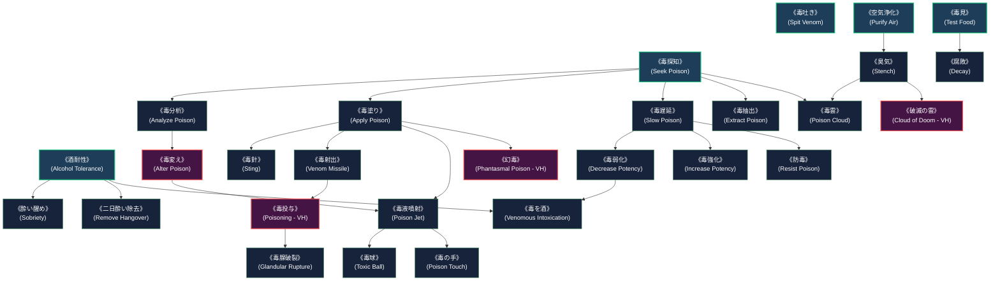

# 毒系呪文アーカイブ (Toxic & Poison Spells)

本ドキュメントは、ガープス第4版（『Pyramid #4/1: Fantasy/Magic 1』『GURPS Magic: Artillery Spells』『GURPS Magic: Death Spells』『GURPS Magic: Plant Spells』『Pyramid #3/68』等）に準拠した**毒系呪文（Toxic & Poison College）**の完全構造化アーカイブです。  
現代の魔導科学、バイオハザード検疫、メガコーポ（テイコク製薬等）の薬品開発、および壁外魔境（奥多摩・東京湾アビス等）における毒性魔獣対策としての運用基準を定めます。

---

## 1. 毒系魔術の基本力学と生体媒介原則

### 1.1 毒の形態と物理・魔術操作
毒性物質は「液体」「気体」「固体（粉末・結晶）」の多様な物理形態をとる。毒系魔術は、生体組織や神経伝達物質に直接干渉する生体親和性の高い魔導力学体系である。
- **液体の毒**: 《水変化》《水噴射》などの水霊系呪文と複合操作が可能。
- **鉱物・結晶の毒**: 《土変化》などの地霊系呪文と複合操作が可能。
- **有毒ガス・エアロゾル**: 《空気変化》《風霊系呪文》と複合操作が可能。

### 1.2 毒の5大投与経路（ガープス基準）
1. **血液毒（Blood Agent）**: 傷口や注射を介して直接血流に侵入する毒（刺し・貫通攻撃で注入）。
2. **接触毒（Contact Agent）**: 素肌に付着することで皮膚から吸収される毒（防護服・DR無視）。
3. **呼吸毒（Respiratory Agent）**: 呼吸器官から吸入される有毒ガス（息止め・気密装備で防護可能）。
4. **空気感染・全身吸収毒（Airborne Contact Agent）**: 吸入および露出皮膚の両方から吸収される極悪エアロゾル（気密防護服・Sealed特性が必要）。
5. **消化毒（Digestive Agent）**: 経口摂取により消化管から吸収される毒（飲食物混入）。

---

## 2. 毒系呪文の前提条件ツリー (Prerequisite Tree)

---

## 3. 毒系呪文一覧表 (Poison Spell List)

| 原書名 | 呪文名 | クラス | 持続時間 | 消費 (詠唱/維持) | 準備時間 | 前提条件 | 現代魔導・軍事・検疫での用途 |
| :--- | :--- | :--- | :--- | :--- | :--- | :--- | :--- |
| **Seek Poison** | 《毒探知》 | 情報 | 一瞬 | 1 / - | 1秒 | なし（基本） | 豊洲市場での毒性検査・前線検問・水質汚染スクリーニング。 |
| **Spit Venom** | 《毒吐き》 | 射撃 | 一瞬 | 2 / - | 1秒 | なし（基本・毒牙所持） | 毒性メタヒューマン・変異魔獣の生体射撃攻撃。 |
| **Alcohol Tolerance** | 《酒耐性》 | 通常 | 1時間 | 1 / 1 (弱者2) | 1秒 | なし（基本） | 会食警護・特殊潜入工作・毒素初期耐性の獲得。 |
| **Analyze Poison** | 《毒分析》 | 情報 | 一瞬 | 2 / - | 1分 | 《毒検知》または《毒探知》 | テイコク製薬の毒性成分特定・解毒血清配合データ抽出。 |
| **Apply Poison** | 《毒塗り》 | 通常 | 永久 | 1 (切断3/m) | 1秒 | 《毒検知》または《毒探知》 | 特殊部隊の徹甲弾・近接刃への即時毒素エンチャント。 |
| **Slow Poison** | 《毒遅延》 | 通常 | 1日 | 3/段階 / 同 | 1秒 | 《毒探知》 | 壁外での被弾・咬傷時の野戦トリアージ・後方搬送時間確保。 |
| **Extract Poison** | 《毒抽出》 | 通常 | 永久 | 1/回分 / - | 1秒 | 《毒探知》 | 魔獣死骸・変異植物からの生体毒素安全抽出・精製。 |
| **Sobriety** | 《酔い醒め》 | 通常 | 一瞬 | 1 / - | 1秒 | 《酒耐性》 | 術士の緊急覚醒・急性アルコール中毒の応急処置。 |
| **Remove Hangover** | 《二日酔い除去》 | 通常 | 永久 | 1 / - | 1秒 | 《酒耐性》 | 市民・ハンターの生活呪文（スラムや歓楽街で多用）。 |
| **Decrease Potency** | 《毒弱化》 | 通常 | 1時間 | 1/抵抗+1 / 同 | 1秒 | 《毒遅延》 | 毒性被害者の生存率向上・解毒処理の支援。 |
| **Increase Potency** | 《毒強化》 | 通常 | 1時間 | 2/抵抗-1 / 同 | 1秒 | 《毒遅延》 | 軍事暗殺・高耐性魔獣に対する毒素殺傷力強化。 |
| **Obscure Poison** | 《毒隠し》 | 通常 | 10時間 | 3 / 1 | 5秒 | 素質1、《毒探知》 | 検問・魔導スキャナーを欺瞞する違法毒物密輸技術。 |
| **Sting** | 《毒針》 | 射撃 | 一瞬 | 1 / - (秒) | 1秒 | 素質1、《毒塗り》 | 隠密暗殺・近距離麻酔針射出（半致傷25m/最大50m）。 |
| **Venom Missile** | 《毒射出》 | 射撃 | 一瞬 | 2 / - | 1秒 | 素質1、《毒塗り》 | 遠距離毒弾投射（中距離戦闘用）。 |
| **Alter Poison** | 《毒変え》 | 通常 | 永久 | 1〜3/回分 | 1秒 | 素質2、《毒分析》 | 消化毒を気化エアロゾルや接触毒へ瞬時変換する禁忌技術。 |
| **Poisoning (VH)** | 《毒投与》 | 通常 | 一瞬 | 3 / - | 5秒 | 素質1、《毒射出》 | 容器内の毒素を遠隔の標的体内へ直接転送投与する至難術式。 |
| **Glandular Rupture** | 《毒腺破裂》 | 通常 | 一瞬 | 5 / - | 3秒 | 素質1、《毒投与》 | 毒性魔獣の体内容積毒腺を暴発させ内部自壊させる対魔獣術式。 |
| **Ignite Poison** | 《毒炎上》 | 範囲 | 10秒 | 1〜5 / - | 1〜5秒 | 素質1、炎作成、毒探知、炎変化 | 毒ガス雲や体内毒素を爆発燃焼させる複合殲滅術式。 |
| **Venomous Intoxication** | 《毒を酒》 | 通常 | 1時間 | 4 / 3 | 1秒 | 《酒耐性》《毒弱化》 | 致死毒を一時的に強烈な酩酊状態へと中和変換する緊急術式。 |
| **Poison Cloud** | 《毒雲》 | 範囲 | 10秒 | 1〜5 / 同 | 1〜5秒 | 素質2、《臭気》、他毒2種 | DR無視の毒性煙霧展開（暴動鎮圧・広域エリア拒否）。 |
| **Poison Jet** | 《毒液噴射》 | 通常 | 1秒 | 1〜3 / 同 | 1秒 | 《水噴射》、他毒4種 | 拳からDR無視2点/コストの毒液を噴射する白兵制圧術。 |
| **Toxic Ball** | 《毒球》 | 射撃 | 一瞬 | 2〜6 / - | 1秒 | 《毒液噴射》 | 濃縮毒液弾の長距離投射（着弾地点での飛散・面制圧）。 |
| **Poison Touch** | 《毒の手》 | 白兵 | 抵抗まで | 1〜3 / - | 1秒 | 素質2、他毒6種 | 素肌接触による持続毒素注入（毎分1点/コスト、DR無効）。 |
| **Phantasmal Poison (VH)** | 《幻毒》 | 通常 | 1分 | 4 / 2 | 2秒 | 素質2、《毒塗り》《幻像》 | 精神錯覚により対象に1d-1の追加毒性負傷を信じ込ませる術式。 |
| **Poison Thorns** | 《毒の茨》 | 通常 | 1時間 | 3 / 2 | 5秒 | 素質1、植物系6種 | 植物に1d-3貫通＋4周期毒素の棘を付与する防壁緑化術。 |
| **Rain of Thorns** | 《茨の雨》 | 範囲 | 1秒 | 4 / 2 | 1秒 | 《毒の茨》 | 広範囲に毒棘の豪雨を降らせる面制圧砲兵術式。 |
| **Toxic Plant** | 《噴毒植物》 | 通常 | 2分 | 1〜8 / - | 1分 | 素質1、《植物繁茂》《嘔吐感》 | 毒ガスを常時放出する防衛変異植物の急速育成術。 |
| **Cloud of Doom (VH)** | 《破滅の雲》 | 範囲 | 5秒 | 5 / - | 1秒 | 素質4、風霊10種 | 毎秒HT-4判定、DR無視1d毒傷を与える最高峰軍事砲兵術式。 |
| **Death’s Banquet (VH)** | 《死毒の宴》 | 通常 | 永久 | 3+2/d | 1秒 | 素質3、《真なる食物》《毒化》 | 食物に最大8dの致死毒を混入し、即死または重度の衰弱をもたらす。 |

---

## 4. 現代社会・軍事・バイオハザードへの適用

### 4.1 テイコク製薬と毒素資源経済
メガコーポ「テイコク製薬」は、奥多摩や東京湾アビスから採取されるClass-B/C魔獣の毒腺から《毒抽出》《毒分析》を用いて新規抗生物質、麻酔薬、神経遮断薬を開発している。特に変異スズメバチやアビス水棲猛毒種の毒素は、1グラムあたり数百万円で取引される戦略物資である。

### 4.2 特殊防護装備（NBCR装備）と結界検問
東京第2同心円ゲート（環七・外環検問所）では、《毒探知》《毒分析》を常時組み込んだ魔導スキャナーゲートが配備されており、Class-C指定の汚染肉や違法生物兵器の持ち込みを厳重に遮断している。対抗措置として密輸組織は《毒隠し》や《毒変え》を用いた欺瞞工作を行うため、検問部隊と犯罪シンジケートの間で絶え間ない情報戦が繰り広げられている。

### 4.3 戦術的解毒トリアージ
壁外アウトランドへ出撃する自衛隊・PMC・プロハンター小隊には、《毒遅延》《防毒》《瞬間解毒》を習得した衛生術士の随伴が義務付けられている。魔獣の奇襲毒牙を受けた場合、即座に《毒遅延》で潜伏周期を先延ばしにし、安全圏へ後送した上で高エネルギー儀礼による《解毒》を行うプロトコルが標準化されている。
