# 水霊系呪文 (Water Spells)

本ドキュメントは、ガープス第4版『魔法大全』第13章（pp.77-83）および公式拡張サプリメント（『Magic: Artillery Spells』『Magic: Death Spells』『Magic: The Least of Spells』『Magic: Plant Spells』等）に準拠した、**全84種**の水霊系呪文公式アーカイブです。マナ力学、生体媒介作用、ならびに2026年現代における結界都市防衛・軍事兵器工学・法規制（CR）の運用データを過不足なく完全網羅しています。

---

## 1. 水霊系呪文の力学体系

水霊系呪文は、マナの指向性周波数を介して対象の物理・生体・霊的パラメータを励起・変調・制御する魔術体系です。
- **生体媒介原則**: マナは術士の生体・神経系・霊体を介して作用し、直接の物質変換や物理エネルギー励起を行います。
- **現代技術インフラとの並行性**: 電子回路や通信網を直接破壊するのではなく、物理的現象（熱、圧力、電磁、物質変形等）を介して現代兵器や都市防護壁と相互作用します。

### 1.1 水霊系呪文 前提条件ツリー (Prerequisite Tree)

```mermaid
graph TD
    %% クラススタイル定義（高コントラスト・ダークモード規格）
    classDef spell fill:#0f172a,stroke:#38bdf8,stroke-width:1.5px,color:#ffffff;
    classDef root fill:#0369a1,stroke:#38bdf8,stroke-width:2px,color:#ffffff,font-weight:bold;
    classDef ext fill:#1e293b,stroke:#94a3b8,stroke-width:1px,color:#cbd5e1,stroke-dasharray: 5 5;
    classDef special fill:#4c1d95,stroke:#c084fc,stroke-width:1.5px,color:#ffffff;

    %% 系統内呪文ノード定義
    subgraph Sub_11CEF989 ["67種"]
        SeekWater["《水探知》<br>(Seek Water)"]:::root
        SeekCoastline["《海岸探知》<br>(Seek Coastline)"]:::spell
        PurifyWater["《水浄化》<br>(Purify Water)"]:::spell
        CreateWater["《水作成》<br>(Create Water)"]:::spell
        DestroyWater["《水破壊》<br>(Destroy Water)"]:::spell
        IcyWeapon["《氷結武器》<br>(Icy Weapon)"]:::spell
        ShapeWater["《水変化》<br>(Shape Water)"]:::spell
        Frost["《霜》<br>(Frost)"]:::spell
        Umbrella["《雨傘》<br>(Umbrella)"]:::spell
        BodyofWater["《肉体液化》<br>(Body of Water)"]:::spell
        FoulWater["《汚水》<br>(Foul Water)"]:::spell
        Freeze["《冷凍》<br>(Freeze)"]:::spell
        Fog["《霧》<br>(Fog)"]:::spell
        IceSlick["《氷面》<br>(Ice Slick)"]:::spell
        IceSphere["《氷球》<br>(Ice Sphere)"]:::spell
        IcyMissiles["《氷の弓》<br>(Icy Missiles)"]:::spell
        MeltIce["《雪解け》<br>(Melt Ice)"]:::spell
        ResistWater["《防水》<br>(Resist Water)"]:::spell
        SnowShoes["《雪靴》<br>(Snow Shoes)"]:::spell
        WalkonWater["《水面歩行》<br>(Walk on Water)"]:::spell
        Waves["《波》<br>(Waves)"]:::spell
        WaterJet["《水噴射》<br>(Water Jet)"]:::spell
        WaterVision["《水中視覚》<br>(Water Vision)"]:::spell
        Whirlpool["《渦巻き》<br>(Whirlpool)"]:::spell
        Coolness["《冷房》<br>(Coolness)"]:::spell
        CreateIce["《氷作成》<br>(Create Ice)"]:::spell
        Dehydrate["《脱水》<br>(Dehydrate)"]:::spell
        IceDagger["《氷剣》<br>(Ice Dagger)"]:::spell
        IcyTouch["《氷の手》<br>(Icy Touch)"]:::special
        WalkThroughWater["《水中歩行》<br>(Walk Through Water)"]:::special
        DrySpring["《涸れ井戸》<br>(Dry Spring)"]:::spell
        EarthtoWater["《土を水》<br>(Earth to Water)"]:::special
        Sp_33_6BE8["《真なる水》<br>(（旧名：聖水）)"]:::spell
        Frostbite["《凍傷》<br>(Frostbite)"]:::spell
        SnowJet["《雪噴射》<br>(Snow Jet)"]:::spell
        BreatheWater["《水中呼吸》<br>(Breathe Water)"]:::spell
        BreatheAir["《空中呼吸》<br>(Breathe Air)"]:::spell
        Sp_38_7EF0["《水泳術》<br>(（旧名：水泳）)"]:::spell
        BodyofIce["《肉体氷化*》<br>(Body of Ice)"]:::special
        BoilWater["《沸騰》<br>(Boil Water)"]:::spell
        CondenseSteam["《凝結》<br>(Condense Steam)"]:::spell
        CreateAcid["《酸作成》<br>(Create Acid)"]:::spell
        CreateSpring["《井戸作成》<br>(Create Spring)"]:::spell
        Current["《水流》<br>(Current)"]:::spell
        Tide["《潮》<br>(Tide)"]:::spell
        FleshtoIce["《肉を氷*》<br>(Flesh to Ice)"]:::special
        CreateSteam["《蒸気作成》<br>(Create Steam)"]:::spell
        Distill["《蒸留》<br>(Distill)"]:::spell
        ResistAcid["《防酸》<br>(Resist Acid)"]:::spell
        SummonWaterElemental["《水霊召喚精霊召喚/水霊》<br>(Summon Water Elemental)"]:::special
        ControlWaterElemental["《水霊支配精霊支配/水霊》<br>(Control Water Elemental)"]:::spell
        CreateWaterElemental["《水霊作成精霊作成/水霊》<br>(Create Water Elemental)"]:::special
        Rain["《雨》<br>(Rain)"]:::spell
        Snow["《雪》<br>(Snow)"]:::spell
        Hail["《雹》<br>(Hail)"]:::spell
        MudJet["《泥噴射》<br>(Mud Jet)"]:::spell
        Geyser["《間欠泉*》<br>(Geyser)"]:::spell
        RainofAcid["《酸の雨》<br>(Rain of Acid)"]:::special
        SteamJet["《蒸気噴射》<br>(Steam Jet)"]:::spell
        AcidBall["《酸の球》<br>(Acid Ball)"]:::special
        AcidJet["《酸噴射》<br>(Acid Jet)"]:::special
        RainofIceDaggers["《氷剣の雨》<br>(Rain of Ice Daggers)"]:::special
        Storm["《嵐》<br>(Storm)"]:::spell
        IcyBreath["《氷吹き*》<br>(Icy Breath)"]:::special
        BreatheSteam["《蒸気吹き*》<br>(Breathe Steam)"]:::special
        SpitAcid["《酸吹き*》<br>(Spit Acid)"]:::special
        Sp_67_2E64["《真なる酸*》<br>(（旧名：聖酸）)"]:::spell
    end

    subgraph Sub_6B5BB4DD ["MAS / MDS 拡張 3種"]
        SummonElemental["《精霊召喚》<br>(Summon Elemental)"]:::special
        ControlElemental["《精霊支配》<br>(Control Elemental)"]:::spell
        CreateElemental["《精霊作成》<br>(Create Elemental)"]:::special
    end

    subgraph Sub_649106C5 ["MAS / MDS 拡張 5種"]
        ArcticBlast["《円錐噴冷*》<br>(Arctic Blast)"]:::special
        ConeofCorrosion["《円錐噴酸*》<br>(Cone of Corrosion)"]:::special
        Scald["《蒸気圏*》<br>(Scald)"]:::special
        Wilting["《集団脱水*》<br>(Wilting)"]:::special
        IceStorm["《氷嵐*》<br>(Ice Storm)"]:::special
    end

    subgraph Sub_E032978 ["MAS / MDS 拡張 2種"]
        Dissipate["《肉体溶失*》<br>(Dissipate)"]:::special
        Drown["《溺死*》<br>(Drown)"]:::special
    end

    %% 前提条件依存関係エッジ
    SeekWater --> SeekCoastline
    SeekWater --> PurifyWater
    PurifyWater --> CreateWater
    CreateWater --> DestroyWater
    CreateWater --> IcyWeapon
    CreateWater --> ShapeWater
    CreateWater --> Frost
    Ext_1 --> Frost
    ShapeWater --> Umbrella
    Ext_2 --> Umbrella
    ShapeWater --> BodyofWater
    PurifyWater --> FoulWater
    Ext_3 --> FoulWater
    ShapeWater --> Freeze
    ShapeWater --> Fog
    Frost --> IceSlick
    ShapeWater --> IceSphere
    IcyWeapon --> IcyMissiles
    Ext_4 --> MeltIce
    Freeze --> MeltIce
    Umbrella --> ResistWater
    ShapeWater --> ResistWater
    DestroyWater --> ResistWater
    ShapeWater --> SnowShoes
    ShapeWater --> WalkonWater
    ShapeWater --> Waves
    ShapeWater --> WaterJet
    ShapeWater --> WaterVision
    ShapeWater --> Whirlpool
    Ext_1 --> Coolness
    Freeze --> CreateIce
    DestroyWater --> Dehydrate
    IceSphere --> IceDagger
    WaterJet --> IceDagger
    Req_5 --> IcyTouch
    ShapeWater --> WalkThroughWater
    DestroyWater --> DrySpring
    Ext_6 --> DrySpring
    CreateWater --> EarthtoWater
    Ext_6 --> EarthtoWater
    Req_7 --> Sp_33_6BE8
    Frost --> Frostbite
    Freeze --> Frostbite
    WaterJet --> SnowJet
    Freeze --> SnowJet
    Ext_8 --> BreatheWater
    DestroyWater --> BreatheWater
    CreateWater --> BreatheAir
    Ext_9 --> BreatheAir
    ShapeWater --> Sp_38_7EF0
    Ext_10 --> Sp_38_7EF0
    BodyofWater --> BodyofIce
    Freeze --> BodyofIce
    ShapeWater --> BoilWater
    Ext_4 --> BoilWater
    Ext_1 --> CondenseSteam
    BoilWater --> CondenseSteam
    CreateWater --> CreateAcid
    Ext_11 --> CreateAcid
    DrySpring --> CreateSpring
    ShapeWater --> CreateSpring
    Req_7 --> Current
    Req_12 --> Tide
    Frostbite --> FleshtoIce
    BodyofWater --> FleshtoIce
    BoilWater --> CreateSteam
    Ext_13 --> Distill
    DestroyWater --> Distill
    CreateAcid --> ResistAcid
    SummonElemental --> SummonWaterElemental
    Ext_14 --> ControlWaterElemental
    Ext_15 --> CreateWaterElemental
    Ext_16 --> Rain
    Ext_16 --> Snow
    Frost --> Snow
    Snow --> Hail
    Ext_17 --> MudJet
    CreateWater --> MudJet
    CreateSpring --> Geyser
    CreateWater --> RainofAcid
    Ext_11 --> RainofAcid
    WaterJet --> SteamJet
    BoilWater --> SteamJet
    CreateAcid --> AcidBall
    WaterJet --> AcidJet
    CreateAcid --> AcidJet
    Hail --> RainofIceDaggers
    IceDagger --> RainofIceDaggers
    Rain --> Storm
    Hail --> Storm
    SnowJet --> IcyBreath
    Ext_18 --> IcyBreath
    SteamJet --> BreatheSteam
    Ext_19 --> BreatheSteam
    AcidJet --> SpitAcid
    ResistAcid --> SpitAcid
    Req_20 --> Sp_67_2E64
    Req_21 --> SummonElemental
    SummonElemental --> ControlElemental
    ControlElemental --> CreateElemental
    Frostbite --> ArcticBlast
    Ext_22 --> ArcticBlast
    AcidJet --> ConeofCorrosion
    CreateSteam --> Scald
    SteamJet --> Scald
    Dehydrate --> Wilting
    Hail --> IceStorm
    Storm --> IceStorm
    BodyofWater --> Dissipate
    EarthtoWater --> Dissipate
    Ext_23 --> Dissipate
    MeltIce --> Dissipate
    BreatheAir --> Drown
    BreatheWater --> Drown

    %% 外部系統・特殊前提ノード
    Ext_1["【他系統: 《冷却》】"]:::ext
    Ext_2["【他系統: 《魔盾》】"]:::ext
    Ext_3["【他系統: 《腐敗》】"]:::ext
    Ext_4["【他系統: 《加熱》】"]:::ext
    Req_5["【前提: 素質1、水霊系4種】"]:::ext
    Ext_6["【他系統: 《土変化》】"]:::ext
    Req_7["【前提: 水霊系6種】"]:::ext
    Ext_8["【他系統: 《空気作成》】"]:::ext
    Ext_9["【他系統: 《空気破壊》】"]:::ext
    Ext_10["【他系統: 《浮揚》】"]:::ext
    Ext_11["【他系統: 《土作成》】"]:::ext
    Req_12["【前提: 水霊系8種】"]:::ext
    Ext_13["【他系統: 《発酵》】"]:::ext
    Ext_14["【他系統: 《水霊召喚》】"]:::ext
    Ext_15["【他系統: 《水霊支配》】"]:::ext
    Ext_16["【他系統: 《雲》】"]:::ext
    Ext_17["【他系統: 《砂噴射》】"]:::ext
    Ext_18["【他系統: 《防寒》】"]:::ext
    Ext_19["【他系統: 《防熱》】"]:::ext
    Req_20["【前提: 酸系呪文6種】"]:::ext
    Req_21["【前提: 素質1、#】"]:::ext
    Ext_22["【他系統: 《氷吹き》】"]:::ext
    Ext_23["【他系統: 《肉を氷》】"]:::ext
```

---

## 2. ガープス第4版『魔法大全』基本水霊系呪文（67種）

| 呪文名（日 / 英） | クラス | 持続時間 | 基本消費 / 維持 | 詠唱時間 | 前提条件 | 効果概要・力学 |
| :--- | :---: | :---: | :---: | :---: | :--- | :--- |
| **《水探知》** Seek Water | 情報 | 一瞬 | 2 | 1秒 | - | 年03月26日(火) 00:01:18 履歴 |
| **《海岸探知》** Seek Coastline | 情報 | 一瞬 | 3 | 10秒 | 《水探知》 | 年03月26日(火) 00:01:33 履歴 |
| **《水浄化》** Purify Water | 特殊 | 永久 | 1/4リットル毎 | 5〜10秒/4リットル毎# | 《水探知》 | 詳細参照 |
| **《水作成》** Create Water | 通常 | 永久 | 2/4リットル毎 | 1秒 | 《水浄化》 | 年03月26日(火) 00:02:11 履歴 |
| **《水破壊》** Destroy Water | 範囲 | 永久 | 3/同 | 1秒 | 《水作成》 | 年03月26日(火) 00:02:25 履歴 |
| **《氷結武器》** Icy Weapon | 通常 | 1分 | 3/1 | 3秒 | 《水作成》 | 年03月26日(火) 00:02:39 履歴 |
| **《水変化》** Shape Water | 通常 | 1分 | 1/80リットル毎 | 2秒 | 《水作成》 | 年03月26日(火) 00:02:53 履歴 |
| **《霜》** Frost | 範囲 | 不定 | 1 | 1秒 | 《水作成》ないし《冷却》 | 効果範囲内の表面一体に霜を下ろします。これは本物の霜で、気温が氷点下なら永久に残ります。気温が高いと、すぐに溶けはじめて水滴になります。本物の 炎 であれ 魔法 の 炎 の上にこの 呪文 をかけると、蒸気が上がり、 炎 は数秒間じゅっと音を立てつづけます。 マッチ やロウソクなどの小さな 炎 なら、この 呪文 で消えてしまうでしょう。 この 呪 |
| **《雨傘》** Umbrella | 通常 | 10分 | 1/1 | 2秒 | 《水変化》ないし《魔盾》 | 年03月26日(火) 00:05:26 履歴 |
| **《肉体液化》** Body of Water | 通常/抵-生命力 | 1分 | 5/2 | 5秒 | 《水変化》 | 共通性質 呪文データ |
| **《汚水》** Foul Water | 範囲 | 永久 | 3 | 1秒 | 《水浄化》、《腐敗》 | 水を飲めなくします。汚水は色も臭いも異様なのですぐにわかりますが、汚染されたビールやワインはもっと見わけにくいでしょう。うっかり汚水を飲んでしまったら、 生命力 判定を行なわねばなりません。成功すれば、気分が悪くなり、 HP を2点失うだけで済みます。失敗すると、激しい腹痛に襲われ、 HP を1D+1点失います |
| **《冷凍》** Freeze | 通常 | 永久 | さまざま | 10秒 | 《水変化》 | 詳細参照 |
| **《霧》** Fog | 範囲 | 1分 | 2/半 | 1秒 | 《水変化》 | 一帯に濃霧を作りだします。わずか1メートルの霧でさえ、視界をさえぎります。霧のなかでは、 炎 による 武器 や飛び道具は特殊な効果を失います。は 目標 までの距離が1メートル霧で埋められているごとに、ダメージが1点減少します（たとえば、ダメージ3Dのが霧に覆われた場所を5メートル移動すると、ダメージは3D-5点となります |
| **《氷面》** Ice Slick | 範囲 | 永久 | 3 | さまざま | 《霜》 | 詳細参照 |
| **《氷球》** Ice Sphere | 射撃 | 一瞬 | 1〜素質# | 1〜3秒 | 《水変化》 | 長射程戦闘関連 |
| **《氷の弓》** Icy Missiles | 通常 | 1分 | 4/2 | 3秒 | 《氷結武器》 | 年03月26日(火) 00:07:40 履歴 |
| **《雪解け》** Melt Ice | 範囲 | 永久# | 2# | 10秒 | 《加熱》ないし《冷凍》 | 年03月26日(火) 00:07:52 履歴 |
| **《防水》** Resist Water | 通常 | 1分 | 2/1 | 1秒 | 《雨傘》ないし、 《水変化》と《水破壊》 | 年03月26日(火) 00:08:06 履歴 |
| **《雪靴》** Snow Shoes | 通常 | 1分 | 2/1 | 2秒 | 《水変化》 | 年03月26日(火) 00:08:21 履歴 |
| **《水面歩行》** Walk on Water | 通常 | 1分 | 3/2 | 4秒 | 《水変化》 | 年03月26日(火) 00:08:33 履歴 |
| **《波》** Waves | 特殊/範囲 | 1時間 | 1÷60/同 | 1分 | 《水変化》 | 大量の水の水面の穏やかさを変化させます。1回の詠唱で、波の高さを ビューフォート風力階級 で1段階上下させることができます。2段階以上変更したいときは、比例して エネルギー を余分に消費しなければなりません。風には影響を与えません。また、 ビューフォート風力階級 は海の波に対応していることに注意してください。一般に同じ風力なら |
| **《水噴射》** Water Jet | 通常 | 1秒 | 1〜3 | 1秒 | 《水変化》 | 年03月26日(火) 00:09:30 履歴 |
| **《水中視覚》** Water Vision | 情報 | 30秒 | 1/1# | 1秒 | 《水変化》 | 水や雪、氷のなかでも視界が利き、沈んだ財宝や徘徊する怪物を発見できます。 |
| **《渦巻き》** Whirlpool | 範囲 | 1分# | 2/半 | さまざま | 《水変化》 | 移動・衝突・踏み・落下 |
| **《冷房》** Coolness | 通常 | 1時間 | 2/1 | 10秒 | 《冷却》 | 年03月26日(火) 00:04:30 履歴 |
| **《氷作成》** Create Ice | 通常 | 永久 | 2/4リットル毎 | 1秒 | 《冷凍》 | 年03月26日(火) 00:10:23 履歴 |
| **《脱水》** Dehydrate | 通常/抵-生命力 | 永久 | 1〜3 | 2秒 | 《水破壊》含む水霊系4種 | 詳細参照 |
| **《氷剣》** Ice Dagger | 射撃 | 一瞬 | 1〜素質# | 1〜3秒 | 《氷球》ないし《水噴射》 | 年03月26日(火) 00:10:43 履歴 |
| **《氷の手》** Icy Touch | 白兵 | 永久 | 2# | 1秒# | 素質1、水霊系4種 | 年03月26日(火) 00:11:06 履歴 |
| **《水中歩行》** Walk Through Water | 通常 | 1秒 | 4/3 | 3秒 | 素質1、《水変化》 | 呪文 呼吸関連 |
| **《涸れ井戸》** Dry Spring | 通常 | 永久 | さまざま# | 1分 | 《水破壊》、《土変化》 | 年03月26日(火) 00:11:30 履歴 |
| **《土を水》** Earth to Water | 通常 | 永久 | 1/1立方m毎# | 1秒 | 素質1、《水作成》、《土変化》 | 土を泥（あるいは水）に変えます。敵や追跡者の身動きを取れなくする、虫さされを治療するための泥を作る、泥人形や囮をつくるために土を柔らかくする......など、さまざまな使い道があります。 |
| **《真なる水》** （旧名：聖水） Essential Water | 通常 | 永久 | 3/4リットル毎 | 1秒 | 水霊系6種 | 年03月26日(火) 00:12:24 履歴 |
| **《凍傷》** Frostbite | 通常/抵-生命力 | 永久 | 1〜3 | 3秒 | 《霜》、《冷凍》 | 年03月26日(火) 00:12:43 履歴 |
| **《雪噴射》** Snow Jet | 通常 | 1秒 | 1〜3 | 1秒 | 《水噴射》、《冷凍》 | 年03月26日(火) 00:13:14 履歴 |
| **《水中呼吸》** Breathe Water | 通常 | 1分 | 4/2 | 1秒 | 《空気作成》、《水破壊》 | 『 水中呼吸薬 』の旧名。 |
| **《空中呼吸》** Breathe Air | 通常 | 1分 | 4/2 | 1秒 | 《水作成》、《空気破壊》 | 空気がまるで水であるかのように呼吸させます。この 呪文 は水棲生物が空気中で乾燥してしまうのも防ぎます。主として、魚や人魚などを水から出した状態で生かしておくのに役立ちます。この 呪文 の目標は、通常どおり水を使って呼吸することもできます。 |
| **《水泳術》** （旧名：水泳） Swim | 通常 | 1分 | 6/3 | 3秒 | 《水変化》、《浮揚》 | 詳細参照 |
| **《肉体氷化*》** Body of Ice* | 通常/抵-生命力 | 1分 | 7/3 | 5秒 | 素質2、《肉体液化》、《冷凍》 | 年03月26日(火) 00:14:48 履歴 |
| **《沸騰》** Boil Water | 通常 | 永久 | さまざま | 10秒 | 《水変化》、《加熱》 | 詳細参照 |
| **《凝結》** Condense Steam | 範囲 | 永久 | 2# | 10秒 | 《冷却》ないし《沸騰》 | 年03月26日(火) 00:15:50 履歴 |
| **《酸作成》** Create Acid | 通常 | 永久 | 4/4リットル毎 | 2秒 | 《水作成》、《土作成》 | 年03月26日(火) 00:16:16 履歴 |
| **《井戸作成》** Create Spring | 通常 | 永久 | さまざま | 1分 | 《涸れ井戸》、《水変化》 | 年03月26日(火) 00:16:37 履歴 |
| **《水流》** Current | 特殊/範囲 | 1時間 | 1÷50/同 | 1分 | 水霊系6種 | 大量の水の流れに影響を与えます。水流の方向を22.5度曲げるか、1.5km/h（または1ノット）増減します。方向と速度を同時に変更したり、もっと大規模な変更を加える場合は、比例して |
| **《潮》** Tide | 特殊/範囲 | 1時間 | 1÷30/同 | 1分 | 水霊系8種 | 波の高さを30センチ、上下させることができます。さらに大きく変化させる場合は、比例して |
| **《肉を氷*》** Flesh to Ice* | 通常/抵-生命力 | 永久 | 12 | 2秒 | 素質1、《凍傷》、《肉体液化》 | （至難）（Flesh to Ice (VH)） _ 生命力 、 生きた 目標 を（所持品ごと！）氷に変えてしまいます。で効果を打ち消せますが、その 術者 がを知らない場合は-4の修正を受けます。でも効果を打ち消せます。 |
| **《蒸気作成》** Create Steam | 範囲 | 5分# | 2 | 1秒 | 《沸騰》 | 年03月26日(火) 00:18:22 履歴 |
| **《蒸留》** Distill | 通常 | 永久 | 1/1リットル毎 | 10秒 | 《発酵》、《水破壊》 | 液体から水分を取り除いて濃縮します。この 呪文 は、たいていは強い酒を作るために用いられますが、 錬金術 にも使われます。この 呪文 を使うごとに液体の体積は半分になり、濃度が倍になります。一度唱えると普通のワインが酒精強化ワイン程度の強さに、2回唱えるとブランデーに、3回でほぼ純粋なアルコールになります。この 呪文 を生きた 目標 に対して |
| **《防酸》** Resist Acid | 通常 | 1分 | 2/半# | 1秒 | 《酸作成》 | 防御・目標 （人、生き物、物体）と、それが持ち運びしているすべてが 酸 の影響を受けなくなります。 |
| **《水霊召喚精霊召喚/水霊》** Summon Water Elemental | 特殊 | 1時間 | 4# | 30秒 | 素質1、水霊系8種あるいは「水霊系4種と他の《精霊召喚》1種」 | 詳細参照 |
| **《水霊支配精霊支配/水霊》** Control Water Elemental | 特殊 | 1分 | 特殊 | 2秒 | 《水霊召喚》 | 詳細参照 |
| **《水霊作成精霊作成/水霊》** Create Water Elemental | 特殊 | 永久 | 特殊 | 特殊 | 素質2、《水霊支配》 | 詳細参照 |
| **《雨》** Rain | 範囲 | 1時間 | 1÷10/同# | 1分 | 《雲》 | ふつうの屋外に降る25ミリの雨を作りだします（あるいは止ませます）。 |
| **《雪》** Snow | 範囲 | 1時間 | 1÷15# | 1秒 | 《雲》、《霜》 | ふつうの屋外に、2.5センチの雪を降らせます（あるいは止ませます）。正しい効果を発揮するには、気温が摂氏0度以下でなければなりません。気温が高ければ、小雨が降るでしょう。これは地面を湿らせる程度で、目立った水溜りは残しません。 これは でも、 でもあります。 |
| **《雹》** Hail | 範囲 | 1分 | 1÷5/同# | 1秒 | 《雪》 | （ひょう。Hail） 雹を降らせます。気温は氷点以上でなければいけません。主な影響として、雹に降られた者は完全に 集中 を破られます。 魔術師 は 集中切れ になりたくなければ、5秒ごとに 意志力判定 を行なわねばなりません。GMが許可するなら、 エネルギー を5倍の消費することにより非常に大粒の雹を降ら |
| **《泥噴射》** Mud Jet | 通常 | 1秒 | 1〜3 | 1秒 | 《砂噴射》、《水作成》 | 年03月29日(金) 20:37:06 履歴 |
| **《間欠泉*》** Geyser* | 範囲 | 1秒 | 5/2 | 5秒 | 《井戸作成》含む水霊系6種、地霊系4種ないし火霊系4種 | 年03月26日(火) 00:21:59 履歴 |
| **《酸の雨》** Rain of Acid | 範囲 | 1分 | 3/3 | 1秒 | 素質2、《水作成》、《土作成》 | 年03月26日(火) 00:23:13 履歴 |
| **《蒸気噴射》** Steam Jet | 通常 | 1秒 | 1〜3 | 1秒 | 《水噴射》、《沸騰》 | 年03月26日(火) 00:23:31 履歴 |
| **《酸の球》** Acid Ball | 射撃 | 一瞬 | 1〜素質# | 1〜3秒 | 素質2、《酸作成》 | 年03月26日(火) 00:24:24 履歴 |
| **《酸噴射》** Acid Jet | 通常 | 1秒 | 1〜3 | 1秒 | 素質2、《水噴射》、《酸作成》 | 年03月26日(火) 00:24:36 履歴 |
| **《氷剣の雨》** Rain of Ice Daggers | 範囲 | 1分 | 2/2# | 1秒 | 素質2、《雹》、《氷剣》 | 詳細参照 |
| **《嵐》** Storm | 範囲 | 1時間 | 1÷50/同 | 1分 | 《雨》、《雹》 | 嵐を引きおこします（あるいは鎮めます）。周囲の気温と湿度によって、暴風だけでなく、雨や雪、雹まじりの暴風雨になったり、奇妙な雷を伴うこともあります。海上で唱えると、とりわけ有効です。この 呪文 は予想外の効果をもたらします。具体的になにが起こるかはGMが決定してください。 この 呪文 は嵐を鎮めるのにも使えます。その効力は、 |
| **《氷吹き*》** Icy Breath* | 通常 | 1秒 | 1〜4 | 2秒 | 素質1、《雪噴射》、《防寒》 | 呪文データ |
| **《蒸気吹き*》** Breathe Steam* | 通常 | 1秒 | 1〜4 | 2秒 | 素質1、《蒸気噴射》、《防熱》 | （至難）（Breathe Steam (VH)） |
| **《酸吹き*》** Spit Acid* | 通常 | 1秒 | 1〜4 | 2秒 | 素質3、《酸噴射》、《防酸》 | 年03月26日(火) 00:26:05 履歴 |
| **《真なる酸*》** （旧名：聖酸） Essential Acid* | 通常 | 永久 | 8/4リットル毎 | 1秒 | 酸系呪文6種 | 年03月26日(火) 00:26:22 履歴 |

---

## 3. 魔導兵器・砲兵戦術拡張呪文（MAS / MDS 拡張 3種）

| 呪文名（日 / 英） | クラス | 持続時間 | 基本消費 / 維持 | 詠唱時間 | 前提条件 | 効果概要・力学 |
| :--- | :---: | :---: | :---: | :---: | :--- | :--- |
| **《精霊召喚》** Summon Elemental | 特殊 | 1時間 | 4# | 30秒 | 素質1、# | （Summon ( ) Elemental） （は は は は ）、 召喚・ 《 |
| **《精霊支配》** Control Elemental | 特殊 | 1分 | 特殊 | 2秒 | 《精霊召喚》# | （Control ( ) Elemental） _ 体力 ・ 意志力 のどちらか高いほう、 水霊 |
| **《精霊作成》** Create Elemental | 特殊 | 永久 | 特殊 | 特殊 | 素質2、《精霊支配》# | （Create ( ) Elemental ） （は は は は ）、 《 |

---

## 4. 魔導兵器・砲兵戦術拡張呪文（MAS / MDS 拡張 5種）

| 呪文名（日 / 英） | クラス | 持続時間 | 基本消費 / 維持 | 詠唱時間 | 前提条件 | 効果概要・力学 |
| :--- | :---: | :---: | :---: | :---: | :--- | :--- |
| **《円錐噴冷*》** Arctic Blast* | 通常 | 一瞬 | 2〜6×終端幅1ｍ毎 | 1秒/威力1d毎 | 素質4、《凍傷》、《氷吹き》 | （至難）（Arctic Blast (VH)） p.27 （至難） 片手から10ｍの長さの 円錐状 の 冷気 を放ち、生きているもの、暖かさを必要とするもの、凍結可能な存在（水の 精霊 など）、そして 炎 のクリーチャー（例：火の 精霊 ）にダメージを与えます。最大幅は 呪文 の エネルギー に応じて増 |
| **《円錐噴酸*》** Cone of Corrosion* | 通常 | 一瞬 | 2〜6×終端幅1ｍ毎 | 1秒/威力1d毎 | 素質4、《酸噴射》 | （至難）（Cone of Corrosion (VH)） p.27 （至難） 片手から10ｍの長さの 円錐状 の 酸 を噴射します。最大幅は 呪文 の |
| **《蒸気圏*》** Scald* | 範囲 | 一瞬 | 2〜10 | 1秒/基本消費2点毎 | 素質4、《蒸気作成》、《蒸気噴射》 | （至難）（Scald (VH)） p.27 （至難） 高圧蒸気の噴流によって範囲が “高熱洗浄” され、 広範囲の負傷 を与えます。「 焼き 」ダメージを与えますが、 着火 はしません。重要な場面（例えば「 弱み 」）では、 熱 と水として扱われますが、 炎 として扱われません。これは 爆発 ではなく範囲効果です。ダメージ |
| **《集団脱水*》** Wilting* | 範囲/抵-生命力 | 一瞬 | 2〜10 | 1秒/基本消費2点毎 | 素質4、《脱水》含む水霊系呪文10種 | （至難）（Wilting (VH)） p.28 （至難） ＿ 生命力 、 に類似していますが、範囲が対象です。範囲内の全ての生きた存在または水生存在は抵抗するか、全身にダメージを受けます。 命中部位 は関係なく、防具も効果を発揮しま |
| **《氷嵐*》** Ice Storm* | 範囲 | 一瞬 | 2〜10 | 1秒/基本消費2点毎 | 素質4、《雹》、《嵐》 | （至難）（Ice Storm (VH)） p.29 （至難） やよりもはるかに大量の氷を効果範囲に吹きあらします。ただし、効果時間は一瞬で、屋内でも効果を発揮します。ギザギザの氷の粒が四方八方から降り注ぐため、防御や身を隠す術はありません。ただし、効果範囲の端に近い被害者は「 遮蔽物に |

---

## 5. 魔導兵器・砲兵戦術拡張呪文（MAS / MDS 拡張 2種）

| 呪文名（日 / 英） | クラス | 持続時間 | 基本消費 / 維持 | 詠唱時間 | 前提条件 | 効果概要・力学 |
| :--- | :---: | :---: | :---: | :---: | :--- | :--- |
| **《肉体溶失*》** Dissipate * | 通常/抵-生命力 | 一瞬 | 12 | 2秒 | 素質3、さらに《肉体液化》と《土を水》、または《肉を氷》と《雪解け》のいずれか | （至難）（Dissipate (VH)） p.21 （至難） _ 生命力 この 呪文 (『 GURPS Magical Styles: Dungeon Magic 』から引用) は、主に水で出来ている存在を対象にします。対象は構造的完全性を失い、溶けて粘液と化します。水 |
| **《溺死*》** Drown * | 通常/抵-生命力 | 4分 | 13 | 1秒 | 素質3、《空中呼吸》、《水中呼吸》 | （至難）（Drown (VH)） pp.21-22 （至難） _ 生命力 対象の肺に水を満たします。これは「 窒息 」と同じ働きをします。犠牲者は1秒あたり 1 FP を失います。 0 FP では、意識を保つために 意志力 判定を行う必要があり、失われた1 FP ごとに1 HP を失います。マイナス FP では、自動 |

---

## 6. 魔導兵器・砲兵戦術拡張呪文（MAS / MDS 拡張 7種）

| 呪文名（日 / 英） | クラス | 持続時間 | 基本消費 / 維持 | 詠唱時間 | 前提条件 | 効果概要・力学 |
| :--- | :---: | :---: | :---: | :---: | :--- | :--- |
| **《沈ませ》（並）** （Sink (A)） | 通常 | 1分 | 3・1 | 3秒 | -（簡単呪文なので） | （並）（Sink (A)） p.14 （並） 対象は、同意する必要がありますが、一時的に「 水に浮かない 」を獲得します。無生物にも発動できますが、誰かを浮かせておくために発動する場合は、影響を受ける全員が同意する必要があります。 発動者は、潜るために自分自身にを発動し、浮上するためにそれを 中断 |
| **《水中会話術》（並）** （Mer-Speech (A)） | 通常 | 1分 | 2・1 | 2秒 | -（簡単呪文なので） | （並）（Mer-Speech (A)） p.17 （並） 対象は一時的に 有利な特徴 「 水中会話 」を得ます。 |
| **《船酔い抵抗》（並）** （Sea Legs (A)） | 通常 | 1時間 | 1・同 | 2秒 | -（簡単呪文なので） | （並）（Sea Legs (A)） p.17 （並） 対象は 船酔い への 抵抗判定 に+3ボーナスを得ます。 |
| **《スポンジ》（並）** （Sponge (A)） | 通常 | 1分 | 1・同 | 2秒 | -（簡単呪文なので） | （並）（Sponge (A)） p.17 （並） 対象者の 手 は、タオルやスポンジのように液体を吸収します。 手 を絞ると液体が絞り出されます。各サイクルは 3秒かかり、2液量オンス (水の場合は約60ミリリットル 約60グラム) が除去されます。 酸 、沸騰したお湯などに対する保護は付与されません。また、あらゆる 毒物 |
| **《噴霧》（並）** （Squirt (A)） | 通常 | 1秒 | 1・同 | 1秒 | -（簡単呪文なので） | （並）（Squirt (A)） p.17 （並） 術者 は1本の指から少量の水を噴射します。 射程 は3メートルです。命中させるにはに対して判定します。これに対して「 止め 」や「 よけ 」できますが、「 受け 」はできません。威力はほぼなく、 突き飛ばし やダメージを与えるには不十分です （ 群れ や 炎 |
| **《汗水》（並）** （Sweat (A)） | 通常 | 一瞬 | 1・同 | 1秒 | -（簡単呪文なので） | （並）（Sweat (A)） p.17 （並） 術者 の体から十分な水が滲み出て、 周期的 な接触効果を中和します。通常の 炎 が燃えている場合は消火し、 酸 や 毒 などを流し去り、さらなるダメージを防ぎます。この 呪文 による水は有効に収集できません (例: 飲用)。湿気によって簡単に破損したり錆びたりする衣服や 鎧 は、 泥や |
| **《追う雲》（並）** （Cloud (A)） | 通常/抵-意志力 | 1分 | 1・同 | 1秒 | -（簡単呪文なので） | （並）（Cloud (A)） p.17 _ 意志力 これをと混同しないでください！ 小さな雲が対象者の2〜25cmほど上に集まり、対象者を追いかけます。これは何もしません（雨を降らせたり、電光を撃ったりなどもってのほかです）が、誰かをマークするのに便利な方 |

---

## 7. 2026年現代戦術・都市防衛・法規制（CR）における運用

### 7.1 警察・自衛隊・PMCにおける実戦配備
結界都市（セーフゾーン）警備および壁外アウトランドへの遠征作戦において、水霊系呪文は索敵・突入支援・防壁維持・目標無力化の標準プロトコルとして統合運用されています。特に部隊随伴術士による即時展開は、通常兵器との複合火力（コンバインド・アームズ）として極めて高い戦闘効率を発揮します。

### 7.2 メガコーポ支配と特許利権
ヤマト重工、テイコク製薬、サエデル・シュティフトゥング、アレス等のメガコーポは、水霊系呪文の工業・医療・防衛利用に関する独占特許を保有しており、民間術士に対するライセンス管理や魔導触媒・霊薬の市場流通を掌握しています。

### 7.3 国際魔導協定（IMA）および法規制（CR）
破壊力・精神汚染・非人道性の高い高位呪文は、国家公安委員会および国際魔導協定により**規制等級CR3〜CR4（要特別国家許可・戦時国際法規制）**に指定されており、無認可での行使・研究は厳罰に処されます。