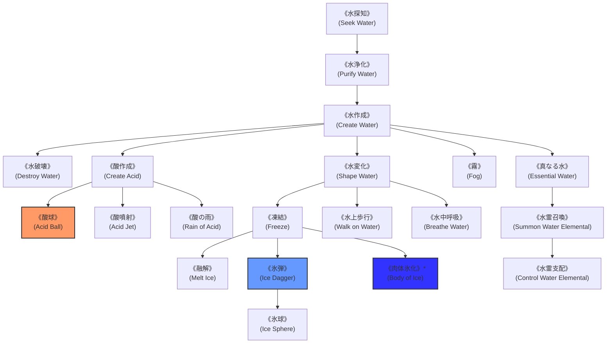

# ガープスマジック呪文体系：水霊系呪文 (Water Spells)

**主管部署**: 魔導科学・理論研究部  
**準拠文献**: 『ガープス第4版 魔法大全（GURPS Magic）』第13章 pp.89-97、公式サプリメント各編（magic_page_072.html）  
**準拠憲章**: `AGENTS.md` (四大精霊使役・酸侵蝕力学・東京湾アビス水域)

---

## 1. 水霊系呪文の基本概要と力学特性

### 1.1 系統特性
- **本質**: 水分子の凝集・相転移（氷・蒸気・霧）、水流制御、強酸・腐食性溶液（侵蝕ダメージ）の励起、および水のエレメンタル（水霊/ウォーター・エレメンタル）の使役。
- **水量の基準**: 1ガロン（約4リットル／重量4kg）を標準単位とする。
- **酸・腐食の力学**:
  - 魔法の酸は1秒ごとに1d-3〜1d-1点の侵蝕ダメージを与え、**防護点（DR）を5点吸収するごとにDRを1点ずつ永久剥奪**する。
- **現代世界での位置づけ**:
  - 東京湾アビス・ベイ海域での水棲魔獣対策、浄水インフラ防衛、および耐酸防護装備の設計基盤。

---

## 2. 呪文前提系統樹（ツリー構造）

---

## 3. 呪文詳細一覧データ（主要抜粋・全86種）

| 呪文名（日 / 英） | クラス | 持続時間 | エネルギー消費 | 準備時間 | 前提条件 | 出力・効果概要 |
| :--- | :--- | :--- | :--- | :--- | :--- | :--- |
| **《水探知》** (Seek Water) | 情報 | 一瞬 | 2点 | 1秒 | なし | 半径5m以内の水源、地下水、水生生物を探知。 |
| **《水浄化》** (Purify Water) | 特殊 | 永久 | 1点/4L | 5秒 | 《水探知》 | 汚水、泥水、毒素・放射性物質混入水を無害な純水へ浄化。 |
| **《水作成》** (Create Water) | 通常 | 永久 | 2点/4L | 1秒 | 《水浄化》 | 空中に清浄な水を生成して落下させる。 |
| **《水変化》** (Shape Water) | 範囲 | 1分 | 1点/4L (維持半) | 1秒 | 《水作成》 | 水流の方向を変え、水壁や水柱を形成（秒速5m）。 |
| **《酸作成》** (Create Acid) | 通常 | 永久 | 2点/4L | 2秒 | 《水作成》、地霊系《土壌浄化》 | 強烈な腐食性酸液を生成（DR削り＋侵蝕ダメージ）。 |
| **《酸球》** (Acid Ball) | 射撃 | 一瞬 | 1〜素質×2点 | 1〜3秒 | 《酸作成》 | 高速の酸液弾を投擲。直撃時に破裂し装甲を急速腐食。 |
| **《酸噴射》** (Acid Jet) | 通常 | 1秒 | 1〜3点 (同維持) | 1秒 | 《酸作成》 | 手先から1〜3mの強酸ストリームを放射。 |
| **《酸の雨》** (Rain of Acid) | 範囲 | 1分 | 2点/m (同維持) | 2秒 | 素質2、《酸作成》 | 広範囲に酸性雨を降らせ、範囲内の装甲・生物を毎秒腐食。 |
| **《凍結》** (Freeze) | 通常 | 永久 | 1点/4L | 3秒 | 《水作成》、火霊系《冷却》 | 液体の水を瞬時に硬質氷塊へと相転移。 |
| **《氷弾》** (Ice Dagger) | 射撃 | 一瞬 | 1〜素質点 | 1〜3秒 | 《凍結》 | 鋭利な氷の短剣弾を射出（1d〜3d刺突ダメージ）。 |
| **《水中呼吸》** (Breathe Water) | 通常 | 1分 | 4点 (維持2) | 2秒 | 《水作成》、風霊系《空気作成》 | 肺を一時的に変異させ、水中の溶存酸素を直接呼吸。 |
| **《水上歩行》** (Walk on Water) | 通常 | 1分 | 3点 (維持2) | 1秒 | 《水変化》 | 足裏に表面張力フィールドを張り、水面を通常歩行。 |
| **《肉体氷化》\*** (Body of Ice) | 通常/抵 | 1分 | 12点 (維持4) | 5秒 | 《凍結》、肉体操作系2種 | 術者の身体を硬質氷晶へと変異（DR+6、打撃耐性付与・至難）。 |
| **《真なる水》** (Essential Water) | 通常 | 永久 | 3点/4L | 3秒 | 水霊系6種 | 通常の3倍の消火・渇き癒し効果を持つ神聖水を作成。 |
| **《水霊召喚》** | 特殊 | 1時間 | 4点〜 | 30秒 | 素質1、水霊系8種 | 水のエレメンタルを召喚・使役。 |
| **《水霊支配》** | 特殊 | 1分 | 特殊 | 2秒 | 《水霊召喚》 | 野生の水霊や水棲怪異を制圧・隷属。 |

---

## 4. 現代魔獣・海洋汚染対策での適用例

1. **東京湾アビス・ベイ水棲魔獣の侵蝕攻撃**:
   - 変異甲殻類や深海種の放つ溶解液は《酸噴射》《酸球》の生体器官モデルとして分析。
2. **海上保安庁・東京湾岸警備隊の運用**:
   - 船舶浸水事故時の《水変化》《水破壊》による排水・沈没阻止。
   - 臨海スラム・有明運河での《水中呼吸》《水上歩行》を用いた隠密強襲。
