# 天候系呪文 (Weather Spells)

本ドキュメントは、ガープス第4版『魔法大全』第18章（pp.110-115）および公式拡張サプリメント（『Magic: Artillery Spells』『Magic: Death Spells』『Magic: The Least of Spells』『Magic: Plant Spells』等）に準拠した、**全39種**の天候系呪文公式アーカイブです。マナ力学、生体媒介作用、ならびに2026年現代における結界都市防衛・軍事兵器工学・法規制（CR）の運用データを過不足なく完全網羅しています。

---

## 1. 天候系呪文の力学体系

天候系呪文は、マナの指向性周波数を介して対象の物理・生体・霊的パラメータを励起・変調・制御する魔術体系です。
- **生体媒介原則**: マナは術士の生体・神経系・霊体を介して作用し、直接の物質変換や物理エネルギー励起を行います。
- **現代技術インフラとの並行性**: 電子回路や通信網を直接破壊するのではなく、物理的現象（熱、圧力、電磁、物質変形等）を介して現代兵器や都市防護壁と相互作用します。

### 1.1 天候系呪文 前提条件ツリー (Prerequisite Tree)

```mermaid
graph TD
    %% クラススタイル定義（高コントラスト・ダークモード規格）
    classDef spell fill:#0f172a,stroke:#38bdf8,stroke-width:1.5px,color:#ffffff;
    classDef root fill:#0369a1,stroke:#38bdf8,stroke-width:2px,color:#ffffff,font-weight:bold;
    classDef ext fill:#1e293b,stroke:#94a3b8,stroke-width:1px,color:#cbd5e1,stroke-dasharray: 5 5;
    classDef special fill:#4c1d95,stroke:#c084fc,stroke-width:1.5px,color:#ffffff;

    %% 系統内呪文ノード定義
    subgraph Sub_571DEE24 ["31種"]
        Frost["《霜》<br>(Frost)"]:::spell
        Fog["《霧》<br>(Fog)"]:::spell
        Sp_3_5B62["《気象予測》<br>(（旧名：天候予測）)"]:::spell
        Waves["《波》<br>(Waves)"]:::spell
        Clouds["《雲》<br>(Clouds)"]:::spell
        Current["《水流》<br>(Current)"]:::spell
        Tide["《潮》<br>(Tide)"]:::spell
        Wind["《風》<br>(Wind)"]:::spell
        Rain["《雨》<br>(Rain)"]:::spell
        Snow["《雪》<br>(Snow)"]:::spell
        Hail["《雹》<br>(Hail)"]:::spell
        Warm["《温暖化》<br>(Warm)"]:::spell
        Cool["《寒冷化》<br>(Cool)"]:::spell
        Storm["《嵐》<br>(Storm)"]:::spell
        WeatherDome["《避難所》<br>(Weather Dome)"]:::spell
        CloudWalking["《雲上歩行》<br>(Cloud-Walking)"]:::spell
        CloudVaulting["《雲飛び*》<br>(Cloud-Vaulting)"]:::special
        ResistLightning["《防電》<br>(Resist Lightning)"]:::spell
        Lightning["《電光》<br>(Lightning)"]:::special
        ExplosiveLightning["《爆裂電光》<br>(Explosive Lightning)"]:::spell
        LightningWhip["《電光の鞭》<br>(Lightning Whip)"]:::spell
        ShockingTouch["《衝撃の手》<br>(Shocking Touch)"]:::spell
        SparkCloud["《雷雲》<br>(Spark Cloud)"]:::spell
        SparkStorm["《雷嵐》<br>(Spark Storm)"]:::spell
        WallofLightning["《電光の壁》<br>(Wall of Lightning)"]:::spell
        BallofLightning["《電光弾》<br>(Ball of Lightning)"]:::spell
        LightningStare["《電光の瞳》<br>(Lightning Stare)"]:::spell
        BodyofLightning["《肉体電化》<br>(Body of Lightning)"]:::special
        LightningArmor["《電光の鎧》<br>(Lightning Armor)"]:::spell
        LightningWeapon["《電撃武器》<br>(Lightning Weapon)"]:::special
        LightningMissiles["《電撃の弓》<br>(Lightning Missiles)"]:::spell
    end

    subgraph Sub_6B5BB4DD ["MAS / MDS 拡張 3種"]
        ChainLightning["《連鎖の電光*》<br>(Chain Lightning)"]:::special
        IceStorm["《氷嵐*》<br>(Ice Storm)"]:::special
        ImprovedExplosiveLightning["《強化爆裂電光*》<br>(Improved Explosive Lightning)"]:::special
    end

    subgraph Sub_E032978 ["MAS / MDS 拡張 2種"]
        GraveGrounding["《肉体電失*》<br>(Grave Grounding)"]:::special
        LethalLightning["《致死の電光*》<br>(Lethal Lightning)"]:::special
    end

    %% 前提条件依存関係エッジ
    Ext_1 --> Frost
    Ext_2 --> Frost
    Ext_3 --> Fog
    Req_4 --> Sp_3_5B62
    Ext_3 --> Waves
    Req_5 --> Clouds
    Req_6 --> Current
    Req_7 --> Tide
    Ext_8 --> Wind
    Clouds --> Rain
    Clouds --> Snow
    Frost --> Snow
    Snow --> Hail
    Ext_9 --> Warm
    Ext_2 --> Cool
    Rain --> Storm
    Hail --> Storm
    Req_10 --> WeatherDome
    Ext_11 --> CloudWalking
    Ext_12 --> CloudWalking
    Ext_13 --> CloudVaulting
    CloudWalking --> CloudVaulting
    Req_14 --> ResistLightning
    Req_15 --> Lightning
    Lightning --> ExplosiveLightning
    Lightning --> LightningWhip
    Lightning --> ShockingTouch
    Ext_16 --> SparkCloud
    Lightning --> SparkCloud
    Ext_8 --> SparkStorm
    Lightning --> SparkStorm
    Lightning --> WallofLightning
    Ext_17 --> BallofLightning
    Lightning --> BallofLightning
    Lightning --> LightningStare
    ResistLightning --> LightningStare
    Lightning --> BodyofLightning
    ResistLightning --> LightningArmor
    Lightning --> LightningWeapon
    LightningWeapon --> LightningMissiles
    BallofLightning --> ChainLightning
    ResistLightning --> ChainLightning
    Hail --> IceStorm
    Storm --> IceStorm
    ExplosiveLightning --> ImprovedExplosiveLightning
    BodyofLightning --> GraveGrounding
    ResistLightning --> GraveGrounding
    Lightning --> LethalLightning

    %% 外部系統・特殊前提ノード
    Ext_1["【他系統: 《水作成》】"]:::ext
    Ext_2["【他系統: 《冷却》】"]:::ext
    Ext_3["【他系統: 《水変化》】"]:::ext
    Req_4["【前提: 風霊系4種】"]:::ext
    Req_5["【前提: 水霊系2種、風霊系2種】"]:::ext
    Req_6["【前提: 水霊系6種】"]:::ext
    Req_7["【前提: 水霊系8種】"]:::ext
    Ext_8["【他系統: 《風嵐》】"]:::ext
    Ext_9["【他系統: 《加熱》】"]:::ext
    Req_10["【前提: 四大精霊系呪文から各2種】"]:::ext
    Ext_11["【他系統: 《空気歩行》】"]:::ext
    Ext_12["【他系統: 《水面歩行》】"]:::ext
    Ext_13["【他系統: 《飛躍》】"]:::ext
    Req_14["【前提: 風霊系6種】"]:::ext
    Req_15["【前提: 素質1、 風霊系6種】"]:::ext
    Ext_16["【他系統: 《空気変化》】"]:::ext
    Ext_17["【他系統: 《念動》】"]:::ext
```

---

## 2. ガープス第4版『魔法大全』基本天候系呪文（31種）

| 呪文名（日 / 英） | クラス | 持続時間 | 基本消費 / 維持 | 詠唱時間 | 前提条件 | 効果概要・力学 |
| :--- | :---: | :---: | :---: | :---: | :--- | :--- |
| **《霜》** Frost | 範囲 | 不定 | 1 | 1秒 | 《水作成》ないし《冷却》 | 効果範囲内の表面一体に霜を下ろします。これは本物の霜で、気温が氷点下なら永久に残ります。気温が高いと、すぐに溶けはじめて水滴になります。本物の 炎 であれ 魔法 の 炎 の上にこの 呪文 をかけると、蒸気が上がり、 炎 は数秒間じゅっと音を立てつづけます。 マッチ やロウソクなどの小さな 炎 なら、この 呪文 で消えてしまうでしょう。 この 呪 |
| **《霧》** Fog | 範囲 | 1分 | 2/半 | 1秒 | 《水変化》 | 一帯に濃霧を作りだします。わずか1メートルの霧でさえ、視界をさえぎります。霧のなかでは、 炎 による 武器 や飛び道具は特殊な効果を失います。は 目標 までの距離が1メートル霧で埋められているごとに、ダメージが1点減少します（たとえば、ダメージ3Dのが霧に覆われた場所を5メートル移動すると、ダメージは3D-5点となります |
| **《気象予測》** （旧名：天候予測） Predict Weather | 情報 | 一瞬 | さまざま | 5秒# | 風霊系4種 | 詳細参照 |
| **《波》** Waves | 特殊/範囲 | 1時間 | 1÷60/同 | 1分 | 《水変化》 | 大量の水の水面の穏やかさを変化させます。1回の詠唱で、波の高さを ビューフォート風力階級 で1段階上下させることができます。2段階以上変更したいときは、比例して エネルギー を余分に消費しなければなりません。風には影響を与えません。また、 ビューフォート風力階級 は海の波に対応していることに注意してください。一般に同じ風力なら |
| **《雲》** Clouds | 範囲 | 10分 | 1÷20/同 | 10秒 | 水霊系2種、風霊系2種 | 屋外にふつうの雲を作りだしたり、追いちらしたりできます（ 術者 の選択）。 |
| **《水流》** Current | 特殊/範囲 | 1時間 | 1÷50/同 | 1分 | 水霊系6種 | 大量の水の流れに影響を与えます。水流の方向を22.5度曲げるか、1.5km/h（または1ノット）増減します。方向と速度を同時に変更したり、もっと大規模な変更を加える場合は、比例して |
| **《潮》** Tide | 特殊/範囲 | 1時間 | 1÷30/同 | 1分 | 水霊系8種 | 波の高さを30センチ、上下させることができます。さらに大きく変化させる場合は、比例して |
| **《風》** Wind | 特殊/範囲 | 1時間 | 1÷50/同 | 1分 | 《風嵐》 | その時点の戸外の風の状態を変更します。風向きを22.5度（たとえば西から西南西に）変更するか、風速を ビューフォート風力階級 で1段階上下させることができます。風向と風速を同時に変更したり、もっと大規模な変更を行なう場合は、比例して |
| **《雨》** Rain | 範囲 | 1時間 | 1÷10/同# | 1分 | 《雲》 | ふつうの屋外に降る25ミリの雨を作りだします（あるいは止ませます）。 |
| **《雪》** Snow | 範囲 | 1時間 | 1÷15# | 1秒 | 《雲》、《霜》 | ふつうの屋外に、2.5センチの雪を降らせます（あるいは止ませます）。正しい効果を発揮するには、気温が摂氏0度以下でなければなりません。気温が高ければ、小雨が降るでしょう。これは地面を湿らせる程度で、目立った水溜りは残しません。 これは でも、 でもあります。 |
| **《雹》** Hail | 範囲 | 1分 | 1÷5/同# | 1秒 | 《雪》 | （ひょう。Hail） 雹を降らせます。気温は氷点以上でなければいけません。主な影響として、雹に降られた者は完全に 集中 を破られます。 魔術師 は 集中切れ になりたくなければ、5秒ごとに 意志力判定 を行なわねばなりません。GMが許可するなら、 エネルギー を5倍の消費することにより非常に大粒の雹を降ら |
| **《温暖化》** Warm | 範囲 | 1時間 | 1÷10/同 | 1分# | 《加熱》、風霊系4種 | 周囲の気温を上昇させます。たとえば、この 呪文 でを無効にできます。摂氏38度以上に上昇させることはできません。この 呪文 は でもあります。 |
| **《寒冷化》** Cool | 範囲 | 1時間 | 1÷10/同 | 1分# | 《冷却》、風霊系4種 | 周囲の気温を下降させます。条件が整えば、霧が発生することもあります。気温を-4度以下にすることはできません。 |
| **《嵐》** Storm | 範囲 | 1時間 | 1÷50/同 | 1分 | 《雨》、《雹》 | 嵐を引きおこします（あるいは鎮めます）。周囲の気温と湿度によって、暴風だけでなく、雨や雪、雹まじりの暴風雨になったり、奇妙な雷を伴うこともあります。海上で唱えると、とりわけ有効です。この 呪文 は予想外の効果をもたらします。具体的になにが起こるかはGMが決定してください。 この 呪文 は嵐を鎮めるのにも使えます。その効力は、 |
| **《避難所》** Weather Dome | 範囲 | 6時間 | 3/2 | 1秒 | 四大精霊系呪文から各2種 | 防御・壁・あらゆる悪天候（の 呪文 、火山灰、カエルの雨、飛んでくる虫まで含みます！）を寄せ付けない、ちらちら光る丸天井を作り出します。洪水、地滑りなどの災害には壊れてしまいます。丸天井のなかでは、空気は常に新鮮で、気温は術者にとって快適と思えるもので保たれます。 |
| **《雲上歩行》** Cloud-Walking | 通常 | 1時間 | 3/2 | 1秒 | 《空気歩行》、《水面歩行》 | ではない。 |
| **《雲飛び*》** Cloud-Vaulting* | 通常 | 150km毎に1秒# | 7 | 1秒 | 素質2、《飛躍》、《雲上歩行》 | 呪文データ 呪文データ |
| **《防電》** Resist Lightning | 通常 | 1分 | 2/1 | 1秒 | 風霊系6種 | 防御・目標 と、 目標 が持ち運んでいるものすべてに、電光と 電気 の効果に耐性を与えます。低い 文明レベル では、ふつうは敵の 魔法 から身を守るために利用されます。文明が進化するにつれ、専門職にとって不可欠な道具となります。 |
| **《電光》** Lightning | 射撃 | 一瞬 | 1〜素質# | 1〜3秒 | 素質1、 風霊系6種 | 指先から電光の矢を放ちます。この矢は 半致傷距離 50、 最大射程 100、 正確さ +3です。この 呪文 に対しては、 金属鎧 の 防護点 はすべて1として扱います！ 目標 が傷を受けると、 生命力 を2点削られるごとに、-1の修正を受けて 生命力 判定を行なわねばなりません。失敗すると 朦朧 状態になります。以降、毎 ターン |
| **《爆裂電光》** Explosive Lightning | 射撃 | 一瞬 | 2〜2×素質# | 1〜3秒 | 《電光》 | 電気 呪文 爆発物 呪文 |
| **《電光の鞭》** Lightning Whip | 通常 | 10秒 | 1/2ｍ毎# | 2秒 | 《電光》 | 年03月28日(木) 21:04:16 履歴 |
| **《衝撃の手》** Shocking Touch | 白兵 | 一瞬 | 1〜3 | 1秒 | 《電光》 | 術者 の両手か 杖 に電光を帯びさせます。この 呪文 を発動させるには、 術者 は 目標 に攻撃を命中させなければなりません。 命中部位 は問いません。 呪文 の エネルギー 1点につき1D+1点の“ 焼き ”ダメージを 目標 に与えます。鎧では防げません。 電子機器 や伝導体のそばでは、と同様、予想外の効果が現われます。 |
| **《雷雲》** Spark Cloud | 範囲 | 10秒 | 1〜5/同 | 1〜5秒 | 《空気変化》、《電光》 | 地面に 電気 を帯びた火花の雲を作りだします。視界をさえぎることはありませんが、範囲内にいる全員に“ 焼き ”ダメージを与えます。 鎧 は通常どおりダメージを防ぎます（ 金属鎧 はの場合と同様、最小限のダメージしか防げません）。 |
| **《雷嵐》** Spark Storm | 範囲 | 1分# | 2,4,6/半 | 一瞬# | 《風嵐》、《電光》 | （かみなりあらし。Spark Storm） ふつうのを作りだしますが、さらに危険な効果が加わります。毎 ターン 、が効果範囲内にいる犠牲者1体をランダムに攻撃します。これを解決するには、 距離修正 を無視して、 術者 の 技能 で判定を行ないます。犠牲者は通常どおり |
| **《電光の壁》** Wall of Lightning | 通常 | 1分 | 2〜6/同 | 1秒 | 《電光》 | 壁・効果範囲の周囲に、ぱちぱちとはぜる 電光 の壁を作りだします。高さは4メートルですが、比例して エネルギー を消費することにより、もっと高くすることもできます（高さ8メートルなら2倍、12メートルなら3倍、以下同様に増えます）。 壁を横切ったり、それに手を触れたものは毎ターン、“ 焼き ”ダメージを受けま |
| **《電光弾》** Ball of Lightning | 通常 | 1分 | 2〜6/半 | 1〜3秒 | 《念動》、《電光》 | 術者 の手の中に球状の 電光 を作りだします。通常のとは異なり、は 術者 の狙った場所に飛んでいきます。ふつうに投げることはできません。この球体はまったく無音で、最大 移動力 「 術者 の 技能 レベル÷5（端数切り捨て）」で、直線状に進みます。風や非金属の障害物の影響はまったく受けません。つまり窓やカー |
| **《電光の瞳》** Lightning Stare | 通常 | 1秒 | 1〜4 | 2秒 | 《電光》、《防電》 | 術者 の 目 から 電光 が放たれます。 術者 は 敏捷力 -4または〈 特殊攻撃 〉による 命中判定 を行ないます。 目標 のほうを向いていなければなりません。詠唱の 儀式 には、 動作 ではなく、 顔 の動きを使うのがふつうです。したがって、 技能レベル に関わらず、この 呪文 はいっさい 動作 なしで唱えることができま |
| **《肉体電化》** Body of Lightning | 通常/抵-生命力 | 1分 | 12/4 | 5秒 | 素質2、《電光》 | _ 生命力 、 目標 に一時的に「 電光の体 」の 共通性質 を与え、動く電光体に変えます。最大3キロまでの衣類も電光に変わりますが、 魔法 のものは魔力を失います。 を、をと同様に扱います。 |
| **《電光の鎧》** Lightning Armor | 通常 | 1分 | 7/4 | 1秒 | 《防電》を含む電光系呪文6種 | ぱちぱちとはぜる 電光 で 目標 を覆います。 目標 や 目標 の所持している物には悪影響はありません（の 呪文 がかかっているのと同様に扱います）。 目標 が 白兵攻撃 を行なうと、電撃による1点の追加ダメージが発生します。 逆に、敵が金属製の 武器 で 目標 を攻撃すると、1D-1点の“ 焼き ”ダメージが跳 |
| **《電撃武器》** Lightning Weapon | 通常 | 1分 | 4/1 | 2秒 | 素質2、《電光》 | 目標 の 白兵武器 が 電気 を帯びます。電光をまとい、ぱちぱちとはぜますが、使用者を傷つけることはありません。すくなくとも 武器 の一部が金属でなければなりません。すべて木/石でできた 武器 はこの 呪文 の対象にはなりません。この 武器 は敵の鎧を貫通して、ダメージ・ボーナスを適用した後のダメージが+2されます。さらに、 |
| **《電撃の弓》** Lightning Missiles | 通常 | 1分 | 4/2# | 3秒 | 《電撃武器》 | と同じですが、これは 射撃武器 に対して唱えます。 武器 そのものが 電光 を帯びます。 武器 から放たれる矢弾はすべて電撃を帯び、と同様の方法で、2点の追加ダメージを与えます。矢弾の木製の部分は「敵に命中する」か「10秒経過する」かした瞬間、灰になってしまいます。 |

---

## 3. 魔導兵器・砲兵戦術拡張呪文（MAS / MDS 拡張 3種）

| 呪文名（日 / 英） | クラス | 持続時間 | 基本消費 / 維持 | 詠唱時間 | 前提条件 | 効果概要・力学 |
| :--- | :---: | :---: | :---: | :---: | :--- | :--- |
| **《連鎖の電光*》** Chain Lightning* | 射撃 | 一瞬 | 2〜2×素質 | 1〜3秒 | 素質4、《電光弾》、《防電》 | magic_artillery_spells |
| **《氷嵐*》** Ice Storm* | 範囲 | 一瞬 | 2〜10 | 1秒/基本消費2点毎 | 素質4、《雹》、《嵐》 | （至難）（Ice Storm (VH)） p.29 （至難） やよりもはるかに大量の氷を効果範囲に吹きあらします。ただし、効果時間は一瞬で、屋内でも効果を発揮します。ギザギザの氷の粒が四方八方から降り注ぐため、防御や身を隠す術はありません。ただし、効果範囲の端に近い被害者は「 遮蔽物に |
| **《強化爆裂電光*》** Improved Explosive Lightning* | 射撃 | 一瞬 | 3〜3×素質 | 1〜3秒 | 素質4、《爆裂電光》を含む「風霊系呪文か天候系呪文」10種 | （至難）（Improved Explosive Lightning (VH)） （至難） と同様ですが、 爆発 半径が広くなっています。中心から1ｍ以上離れた対象へのダメージは、距離の3倍ではなく、距離（1メートル）で割ります。 これも です。 |

---

## 4. 魔導兵器・砲兵戦術拡張呪文（MAS / MDS 拡張 2種）

| 呪文名（日 / 英） | クラス | 持続時間 | 基本消費 / 維持 | 詠唱時間 | 前提条件 | 効果概要・力学 |
| :--- | :---: | :---: | :---: | :---: | :--- | :--- |
| **《肉体電失*》** Grave Grounding * | 通常/抵-生命力 | 一瞬 | 14 | 5秒 | 素質3、《肉体電化》、《防電》 | の殺人的応用で、足場に被害者の 電気の体 を散らさせて殺す呪文。 （至難）（Grave Grounding (VH)） p.22 （至難） _ 生命力 この 魔法 はと同様に、対象とその衣服（最大3kg）を 電気 に変えます。さらに対象 |
| **《致死の電光*》** Lethal Lightning * | 射撃 | 一瞬 | 2〜2×素質# | 1〜3秒 | 素質3、《電光》 | （至難）（Lethal Lightning (VH)） p.22 （至難） とほぼ同じように機能します。 金属鎧 を DR 1として扱い、「 サージ 」修正があるかのように動作しますが、目標の全身に 致死性の電気ダメージ を与えます。 によって 負傷 した者は、この 負傷 |

---

## 5. 魔導兵器・砲兵戦術拡張呪文（MAS / MDS 拡張 3種）

| 呪文名（日 / 英） | クラス | 持続時間 | 基本消費 / 維持 | 詠唱時間 | 前提条件 | 効果概要・力学 |
| :--- | :---: | :---: | :---: | :---: | :--- | :--- |
| **《追う雲》（並）** （Cloud (A)） | 通常/抵-意志力 | 1分 | 1・同 | 1秒 | -（簡単呪文なので） | （並）（Cloud (A)） p.17 _ 意志力 これをと混同しないでください！ 小さな雲が対象者の2〜25cmほど上に集まり、対象者を追いかけます。これは何もしません（雨を降らせたり、電光を撃ったりなどもってのほかです）が、誰かをマークするのに便利な方 |
| **《ジョルト》（並）** （Jolt (A)） | 射撃 | 1分 | 1 | 1秒 | -（簡単呪文なので） | （並）（Jolt (A)） p.17 術者 の手から 電気 （アーク放電）が発射されます。 正確さ は0、 半致傷距離 5、 最大射程 10。命中させるには、〈 特殊攻撃 /射出物〉を使用します。 命中した者は、 生命力 +1で 抵抗判定 しなければなりません。抵抗ボーナスは被害者の DR に等しく ( 金 |
| **《風害微減》（並）** （Storm Shelter (A)） | 通常 | 1時間 | 1・同 | 2秒 | -（簡単呪文なので） | （並）（Storm Shelter (A)） p.17 防御・悪天候は、 ビューフォート風力階級 で1段階緩和されているかのように、対象者 (家や 乗り物 ではなく) に個人的に影響します。ほとんどの場合、船外への 落下 を回避したり、豪雨の中で物事を見るなどの判定で、ペナルティが-1修正分 |

---

## 6. 2026年現代戦術・都市防衛・法規制（CR）における運用

### 6.1 警察・自衛隊・PMCにおける実戦配備
結界都市（セーフゾーン）警備および壁外アウトランドへの遠征作戦において、天候系呪文は索敵・突入支援・防壁維持・目標無力化の標準プロトコルとして統合運用されています。特に部隊随伴術士による即時展開は、通常兵器との複合火力（コンバインド・アームズ）として極めて高い戦闘効率を発揮します。

### 6.2 メガコーポ支配と特許利権
ヤマト重工、テイコク製薬、サエデル・シュティフトゥング、アレス等のメガコーポは、天候系呪文の工業・医療・防衛利用に関する独占特許を保有しており、民間術士に対するライセンス管理や魔導触媒・霊薬の市場流通を掌握しています。

### 6.3 国際魔導協定（IMA）および法規制（CR）
破壊力・精神汚染・非人道性の高い高位呪文は、国家公安委員会および国際魔導協定により**規制等級CR3〜CR4（要特別国家許可・戦時国際法規制）**に指定されており、無認可での行使・研究は厳罰に処されます。