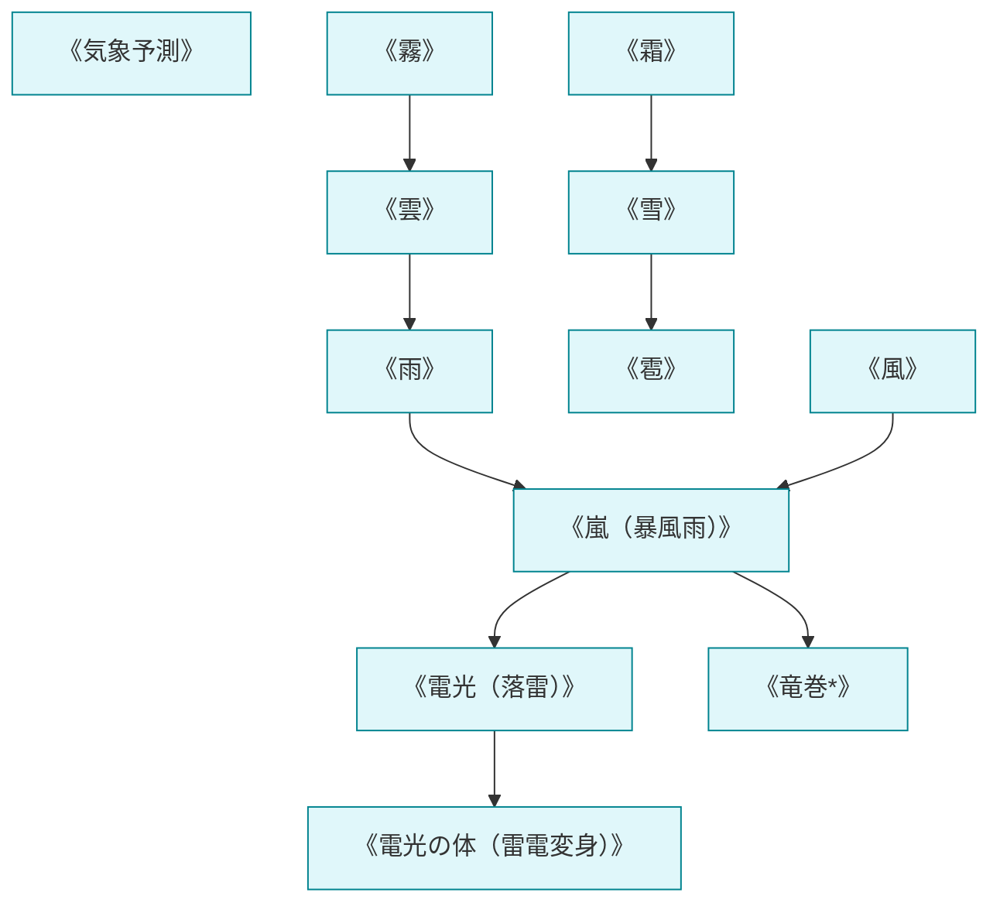

# 天候系呪文 (Weather Spells)

本ドキュメントは、ガープス第4版『魔法大全』第18章（pp.128-133）および関連拡張サプリメントの公式データを基に、大気力学・降雨・降雪・落雷・暴風制御、および2026年現代における結界都市環境調整・特異気象魔境対策を体系化した公式魔術アーカイブです。

---

## 1. 天候系魔術の力学

天候系呪文は、「風霊系」と「水霊系」の複合魔術であり、大気圧、湿度、温度勾配、雲粒凝結を広域マナで変調させる大規模環境魔術です。術士単独では数百メートル四方の局所制御が限界ですが、儀式魔術や都市型マナ発生炉と連動することで数キロ〜数十キロ規模の気象誘導が可能となります。

### 1.1 前提条件ツリー (Prerequisite Tree)

---

## 2. 天候系主要呪文データ一覧

| 呪文名（日 / 英） | クラス | 基本消費 / 維持 | 詠唱時間 | 前提条件 | 効果概要・力学 |
| :--- | :---: | :---: | :---: | :--- | :--- |
| **《気象予測》** Predict Weather | 情報 | さまざま | 5秒 | 風霊系4種 | 今後数時間〜数日間の特定地域の気象・降雨・風向を完全予知。 |
| **《霧》** Fog | 範囲 | 2 / 半 | 1秒 | 《水変化》 | 視界を数メートルに遮る濃霧を瞬時に発生させ、光学追尾を妨害。 |
| **《雲》** Clouds | 範囲 | 1÷20 (面積毎) / 同 | 10秒 | 水霊系2種, 風霊系2種 | 上空に低層雲・積乱雲を形成し、直射日光を遮断。 |
| **《風》** Wind | 特殊/範囲 | 1÷50 / 同 | 1分 | 《風嵐》 | ビューフォート風力階級で最大風力8（疾強風・秒速20m）を誘導。 |
| **《雨》** Rain | 範囲 | 1÷10 / 同 | 1分 | 《雲》 | 雲から恵みの雨または視界を奪う豪雨を降らせる。 |
| **《雪》** Snow | 範囲 | 1÷15 / 同 | 1秒 | 《雲》, 《霜》 | 降雪をもたらし、気温低下と路面凍結を誘発。 |
| **《嵐》** Storm | 範囲 | 1÷5 / 同 | 5分 | 《風》, 《雨》 | 強風と豪雨が吹き荒れる暴風雨圏を形成。 |
| **《電光（落雷）》** Lightning | 射撃 | 1〜素質 (1d毎) | 1〜3秒 | 《雨》, 風霊系6種 | 天空または手先から数百万ボルトの超高圧電撃ビームを撃ち込む。 |
| **《竜巻*》** Tornado | 範囲 | 1 (面積毎) / 同 | 5分 | 《嵐》, 風霊系9種 | 建造物を倒壊させ車両を巻き上げる猛烈な漏斗雲（竜巻）を生成。 |
| **《電光の体》** Body of Lightning | 通常 | 12 / 3 | 3秒 | 《電光》, 素質3 | 肉体を純粋なプラズマ・稲妻に変質（物理無効、超高速突進）。 |

---

## 3. 2026年結界都市防衛および魔境台風対策

### 3.1 気象庁魔導気象課と東京アウター・バッファーゾーンの豪雨・雷撃制御
奥多摩・秩父魔境および東京湾アビス・ベイから流入する高濃度マナ嵐（特異気象）に対しては、春日部地下放水路要塞神殿および調布飛行場の気象魔導班が《気象予測》《雲散》《風》を発動し、都心部への直撃を回避させています。

### 3.2 対空大型飛行魔獣に対する《電光（落雷）》誘導防空
巨大怪鳥（ルフ）やワイバーン等の高高度侵入魔獣に対し、自衛隊高射特科部隊は対空機関砲と連動して《電光》投射術士を配備し、被弾によって飛行筋を麻痺させて撃墜する連携防空網を敷いています。
