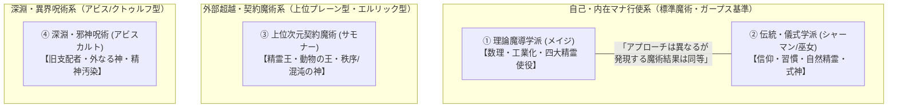

# 魔導科学・理論研究設定資料 (Thaumaturgical Theory Division)

**主管部署**: 魔導科学・理論研究部  
**準拠憲章**: `AGENTS.md` (完全並行・非物質性・生体魂干渉・テクノマジック黎明期)  
**魔術規模の前提**: 『ガープス・マジック（GURPS Magic / 魔法大全）』基準

---

## 1. マナ（魔力）の根本物理法則

### 1.1 非物質性と不可知性
- 「マナ粒子」「魔力元素」といった物質的・素粒子的な実体は、現代の量子物理学・加速器実験でも**未検出（非物質）**である。
- 観測機器で直接マナを捉えることはできず、「生体組織の変異」「神経系の発火」「熱量・力学的な異常現象」などの間接的生体・物理反応としてのみ計測される。

### 1.2 作用対象の限定性（完全並行理論）
- マナは電子機器、シリコン半導体、電磁波、送電網などの**純粋な無機物理現象とは基本的に干渉しない**。
- マナが直接作用するのは以下の3領域に限られる：
  1. **生体組織（DNA・細胞・生理機能）**: 急速な突然変異、肉体強化、外殻硬化
  2. **精神・神経系（意識・脳機能）**: 精神汚染、狂気、恐怖誘発、幻覚、テレパシー
  3. **魂・アストラル体（生命力・霊性）**: 霊体・ゴーストの形成、生体エネルギーの変換

---

## 2. 現代魔術の4大体系分類

### 2.1 理論魔導学派（ハーメチック・メイジ / Hermetic Mage）
- **概要**: 2000年のマナ覚醒以降、マナの波長や生体反応を数値化・数理モデル化し、魔術を「工学・技術」として再現・工業化しようとする学派。
- **担い手**: メガコーポ研究員、防衛省・警察の近代魔法部隊、アカデミア。
- **特徴・術理**: 術式プログラミングと幾何学陣による高い再現性。四大元素精霊（地・水・火・風）の論理的使役。

### 2.2 伝統・儀式学派（シャーマニズム / Shamanism）
- **概要**: 太古からの宗教的儀礼、自然信仰、トランス状態、伝統的習慣を通じてマナと同調・行使する学派。
- **担い手**: 神道の巫女・神職、修験道の山伏、陰陽師、ネイティブ・シャーマン、ドルイド、密教僧。
- **特徴・術理**: 守護精霊（トーテム）や神仏への祈り、祝詞・マントラを通じたアストラル体の励起。自然精霊・式神の使役。
- **メイジとの関係**: 理論・思想は異なるが、生体アストラル体を介して発現する魔術現象（火力、治癒力、障壁強度）は理論魔導と同等。

### 2.3 上位次元契約魔術（プレーン・パクト / Planar Pact）
- **概要**: 術者自身の微小なマナではなく、高次元（上位プレーン）に存在する超越的存在と厳格な契約を結び、権能を借り受ける魔術。
- **契約対象**: 精霊の王（エレメンタル・ルーラー）、動物の王（ビーストロード）、秩序・混沌の神格。
- **特徴・代償**: ガープスマジックの個人限界を超える強大な現象や高位精霊を召喚可能だが、厳格な誓約（ジオス/禁忌）と対価を要し、違反時は魂の剥奪等の破滅が訪れる。

### 2.4 深淵・邪神呪術（アビス・ソーサリー / Abyssal Sorcery）
- **概要**: マナ特異点（アビス領域）の奥底や宇宙深淵に潜む「旧支配者」「外なる神」などの不可知・狂気の存在の波長を受信・行使する禁忌呪術。
- **危険性**: 物理法則を無視した異形化や精神汚染（狂気・SAN値崩壊）を伴う。国際法上「特級バイオハザード・即時殲滅対象」に指定。

---

## 3. 魔術障壁と物理エネルギー力学

### 3.1 障壁の展開原理
- 魔獣や術士が展開する「魔術障壁」は、空間の局所的な歪みまたは生体アストラル場の干渉によって生じる力場である。
- **低エネルギー物理弾（小口径拳銃弾・小銃弾等）**: 障壁の表面張力・弾性反発によって無効化または大幅に威力が減衰される。

### 3.2 物理突破のメカニズム
- 障壁には耐久上限（耐衝撃限界値）が存在する。
- **高エネルギー重火器・対戦車ミサイル・爆撃**: 爆風の圧力波、超高熱、および超音速徹甲弾の圧倒的な物理運動エネルギーによって、障壁の干渉限界を超過させて容易に粉砕・貫通可能である。

---

## 4. テクノマジック（電脳魔術）の最先端と限界

### 4.1 現行技術水準（黎明期・過渡期）
- 魔力を直接電気や動力に変換する一般製品はまだ存在しない。
- メガコーポの最先端研究所において、「生体脳波を介して魔力を電気信号にバイパスし、電子機器を遠隔クラッキングする**電脳魔術**」や「生体魔力リアクター」の実験が非人道的かつ極秘に進められている。

### 4.2 魔法付与（エンチャント）の現状
- 工業的な魔力付与弾・武器コーティング技術は未確立。
- 現代において効果を発揮する付与具は、伝統的なシャーマンや巫女の儀式具、および国家が厳重保管する古代の「伝説の呪具」のみである。

---

## 5. 人間の魔術出力限界（ガープスマジック基準）と現代兵器バランス

| 魔術領域 | ガープス基準の出力規模 | 現代通常兵器との力関係・役割分担 |
| :--- | :--- | :--- |
| **攻撃魔術** | 火球・電撃・力場弾（1〜3dダメージ） | 拳銃〜突撃銃・グレネード弾相当。瞬間火力は通常火器と同等〜やや劣る。 |
| **儀式魔術** | 複数術士・長時間（大結界、天候操作） | 結界都市の防護結界維持や特異点の封じ込めに用いられる。 |

---

## 6. 超巨大魔獣・竜種の生体マナ熱力学と「生体マナ炉心仮説」（未解明フロンティア）

### 6.1 熱力学的パラドックスとエネルギー収支問題
- **マナ覚醒による地球総エネルギーの増大**: 西暦2000年のミレニアム・アウェイクニング以降、異界・アビス特異点から「マナ」という未知のエネルギーが流入したことで、地球生態系の総エネルギー量は物理学的・熱力学的に大きく増大した。
- **捕食カロリーの圧倒的不足**: しかしながら、全長数十メートルから数キロメートル（最大でクニヒキリュウのような20km級）に及ぶ超巨大魔獣や古代竜種の生命活動・巨体維持・飛行・重力制御に必要なエネルギー量は、周囲の野生動植物の捕食（経口摂食カロリー）だけでは到底賄いきれない。

### 6.2 「生体マナ炉心（生体エーテル・リアクター）」仮説
- **食事以外のエネルギー直接取得**: 魔導生物学者および魔導物理学者たちは、超巨大種が消化管を通じた化学的カロリー摂取とは別に、**「大気中・地脈レイラインの高濃度環境マナを直接吸入・励起・生体動力へと変換する未知の生体器官（生体マナ炉心 / Organum Aetheroreactor）」**を体内に保有していると推測している。
- **遠隔観測による学術的エビデンス**:
  - 超巨大竜種の活動時における周囲大気マナ濃度の急激な局所低下（マナ吸引現象）。
  - 熱赤外線サーモグラフィおよび高感度マナ共鳴分光計による、胸部・体幹深部における特異な高エネルギー共鳴ピークの観測。
  - サエデル・シュティフトゥング、テイコク製薬、三ツ菱マナテック、各国魔導アカデミーによる観察論文の提出。

### 6.3 現在の到達点と未解明課題（ブラックボックス）
- **生体解剖の不可能性**: 竜種や超巨大魔獣は国際不可侵条約により保護されているか、あるいは軍事的に捕獲・撃破が不可能な天災級存在（Threat Level: IV〜V）であるため、生体または新鮮な遺骸の完全解剖調査は一度も成功していない。
- **魔導科学・理論研究部の継続課題**: 「生体マナ炉心の微細細胞構造」「マナから運動エネルギー・生体電流への直接変換効率」「炉心の過負荷（マナ・メルトダウン）リスク」などの詳細な内部メカニズムは、2026年現在も魔導科学界最大のブラックボックス（未解明課題）として研究が続けられている。

